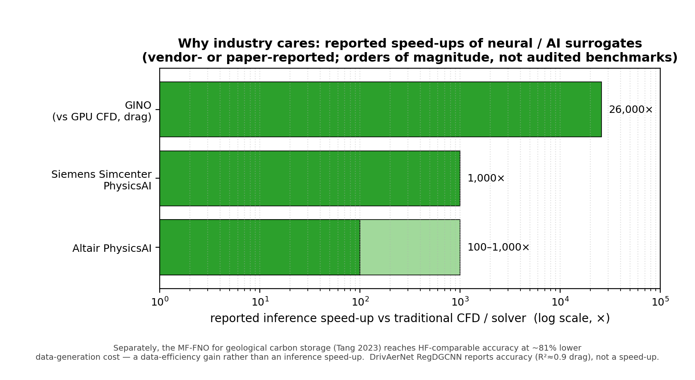

# Multi-Fidelity Modeling for Engineering Design

## State of the Art in Industry and Academia, and a Head-to-Head with the MFFP Model Zoo

**Prepared for:** MFFP (Multi-Fidelity Field Prediction) research project
**Date:** 27 June 2026
**Scope:** Part 1 — how industry across all sectors actually does multi-fidelity (MF) engineering design.
Part 2 — the academic state of the art (SOTA) in machine-learning multi-fidelity *field* prediction.
Part 3 — a head-to-head mapping of that SOTA onto the 30 model families benchmarked in this repository.
**Method note:** every external paper attribution, benchmark number, and corporate fact below was cross-checked against the primary source (arXiv abstract/HTML, company press release, or the repository's own files); a Claude–Codex adversarial fact-checking loop was used to catch attribution and version errors.

---

## Executive summary

Multi-fidelity (MF) modeling fuses abundant cheap **low-fidelity (LF)** data with scarce expensive **high-fidelity (HF)** data so that an HF-quality answer can be obtained for a fraction of the HF cost.
The field splits cleanly along two axes, and understanding both is the key to placing this repository correctly.

1. **The fidelity-fusion axis** — *how* LF and HF information are combined.
   Industry's workhorse here is still the classical Gaussian-process toolkit (co-kriging / auto-regressive AR1, recursive co-kriging, multi-fidelity Bayesian optimization), formalized by Kennedy & O'Hagan (2000) and surveyed by Peherstorfer, Willcox & Gunzburger (SIAM Review, 2018).
   Academia's frontier on this axis is neural-operator MF fusion: transfer learning, additive/multiplicative discrepancy, coregionalization, MF-DeepONet, MF neural processes, and physics-informed fusion.

2. **The geometry-generality axis** — *what kind of domain* the surrogate runs on.
   The current academic and industrial excitement is concentrated here: geometry-general neural operators (GINO, Transolver, Universal Physics Transformers / AB-UPT) that predict full 3-D fields on raw, million-cell industrial meshes — but almost all of them are **single-fidelity**.

**This repository lives squarely on axis 1 and deliberately holds axis 2 fixed.**
It isolates the MF-fusion mechanism by keeping the backbone *family* (a Fourier Neural Operator, FNO) and the geometry (2-D structured PDE grids) roughly constant across 30 families, so that the main thing varying is how LF and HF are fused.
That is exactly the right experimental design for answering "which MF mechanism is best," and it is *not* what the geometry-general operators (GINO/Transolver/AB-UPT) are designed to answer.

**Three findings of this report:**

- The repository's leading mechanism — **transfer learning with FiLM conditioning** (`mf_fno_transfer_film`) and its physics-augmented sibling (`mf_fno_pinn_transfer`) — agrees with the broad literature trend that *simple LF→HF transfer plus the right conditioning beats elaborate fusion architectures*.
  On the specific datasets where published numbers exist, the in-house families already match or beat the 2022–2024 published MF-field-prediction baselines (Infinite-Fidelity Coregionalization, Li et al. 2022; Multi-Fidelity Residual Neural Processes, Niu et al. 2024) on several datasets (e.g. `heat_local`, `fluid`), while trailing on others (e.g. `poisson_local`).
- The repository's **FIRE family** (conditioning the HF correction on the LF *predictive distribution*, not just the LF mean) is a genuinely novel *field-operator* contribution; it ports the distribution-conditioning idea of FIRE — itself a 2026 tabular-foundation-model MF regression method by the same group (Yu, Sung & Ahmed) — onto an FNO field-correction operator, which no prior published field method does.
- The biggest gap between this repository and the *industrial* frontier is axis 2: industry increasingly needs MF on complex 3-D geometries and million-cell meshes (DrivAerML, GINO, AB-UPT), and almost nobody has yet combined strong MF fusion *with* a geometry-general operator.
  That intersection — a **multi-fidelity GINO / Transolver** — is the clearest open opportunity, and the repository's FiLM-transfer and FIRE mechanisms are well-positioned to supply the fusion half of it.

---

## Part 0 — Framing: what "multi-fidelity" means and the two axes

A "fidelity" is any cheaper, less accurate stand-in for the gold-standard model: a coarser mesh, a looser solver tolerance, a simplified physics (RANS instead of LES, potential flow instead of Navier–Stokes), a 2-D slice instead of 3-D, or a faster but biased simulator.
The canonical reference is **Peherstorfer, Willcox & Gunzburger, "Survey of Multifidelity Methods in Uncertainty Propagation, Inference, and Optimization," SIAM Review 60(3):550–591, 2018** (DOI 10.1137/16M1082469).
It frames MF around *outer-loop* applications (optimization, uncertainty quantification, inference) and three ways to manage LF models: **adaptation** (correct the LF model using HF data), **fusion** (combine LF and HF outputs, e.g. co-kriging), and **filtering** (use the LF model to decide when to invoke the HF model).

Two orthogonal axes organize everything that follows.

- **Axis 1 — fidelity fusion:** the mathematical rule that maps {LF data, HF data} → HF prediction.
  Examples: additive discrepancy `HF = LF + δ`; multiplicative/auto-regressive `HF = ρ·LF + δ`; recursive co-kriging; coregionalization with a continuous fidelity index; transfer learning (pretrain on LF, fine-tune on HF); uncertainty-conditioned residual learning.
- **Axis 2 — geometry generality:** whether the surrogate is tied to a fixed grid/parameterization (classical surrogates, vanilla FNO on a structured grid) or can ingest arbitrary 3-D geometry (point clouds, signed distance functions, meshes) — the domain of GINO, Transolver, and Universal Physics Transformers.

Most published work moves along *one* axis at a time.
This repository is a deep, controlled study of **axis 1** with axis 2 deliberately pinned to "simple 2-D grid."

---

## Part 1 — Industry practice across all sectors

### 1.1 The classical workhorse: co-kriging, multi-fidelity Bayesian optimization, and reduced-order models

For two decades, "multi-fidelity in engineering design" has in practice meant **Gaussian-process (GP) co-kriging plus Bayesian optimization**, and this is still what most production design-optimization workflows use.

- **Auto-regressive co-kriging (AR1):** Kennedy & O'Hagan (Biometrika, 2000) introduced the auto-regressive model in which the HF response is the LF response scaled by `ρ` plus an independent GP discrepancy `δ`; the common simple form takes `ρ` as a constant, `HF(x) = ρ·LF(x) + δ(x)`, though the original framework also allows a regression/scaling structure.
  This AR1 scheme is the single most widely deployed MF method in aerospace design.
- **Recursive co-kriging:** Le Gratiet & Garnier (2014) reformulated AR1 as a recursive cascade across fidelity levels, making it cheap to fit many levels; this is the "telescoping" multi-level correction.
- **Nonlinear information fusion:** Perdikaris et al. ("Nonlinear information fusion algorithms for data-efficient multi-fidelity modelling," Proc. R. Soc. A, 2017) generalized AR1 to a nonlinear `ρ(·)` (NARGP), capturing cases where the LF→HF map is not a constant scaling.
- **Scalable probabilistic MF.** Beyond classical co-kriging, the modern probabilistic toolkit includes deep Gaussian processes, sparse/variational multi-output GPs, and deep-kernel multi-fidelity GPs, which bridge classical co-kriging and neural MF and scale better to higher dimensions.
- **Multi-fidelity Bayesian optimization (MFBO):** the GP surrogate is wrapped in an acquisition function that trades off exploration, exploitation, and *fidelity cost*, so the optimizer spends HF evaluations only where they matter.
  A current review is **Do & Zhang, "Multi-fidelity Bayesian Optimization: A Review," arXiv:2311.13050 (2023, rev. 2025)**.
  In aerospace, multi-fidelity efficient global optimization (e.g. Bartoli et al., *Aerospace Science and Technology*, 2019) layers analytical models, CFD, and wind-tunnel data into a single progressive GP.
- **Reduced-order models (ROM) and digital twins:** proper-orthogonal-decomposition (POD) and operator-inference ROMs compress HF simulations into fast low-dimensional models.
  Component-based ROMs assembled from HF finite-element simulations underpin *predictive digital twins* (Willcox group, AIAA SciTech 2020), and ROMs are the standard "fast model" inside aerospace/automotive digital-twin stacks.
  Market context: industry surveys (IDC, McKinsey) report broad digital-twin adoption with strong double-digit CAGR, with ROMs as the enabling fast-model layer.

**Takeaway:** the everyday industrial MF method is GP co-kriging / MFBO on *scalar or low-dimensional* quantities of interest (drag, lift, peak stress, efficiency), not full-field prediction.
The repository's `fno_additive`, `fno_autoregressive`, `fno_multilevel`, and `fno_coregionalization` families are precisely the FNO-ized, full-field generalizations of this classical toolkit.

### 1.2 The AI-surrogate wave: every major CAE vendor now ships a neural surrogate

The last three years saw every major simulation vendor add a deep-learning surrogate / AI-ROM product, amid heavy consolidation of the CAE industry.
These are the channels through which most OEMs (including automotive companies such as General Motors, Ford, and Toyota) actually consume modern ML surrogates.

- **NVIDIA PhysicsNeMo** (formerly *Modulus*): an open-source (Apache-2.0, PyTorch) physics-AI framework supporting FNO, AFNO, PINO, DeepONet, physics-informed neural networks, graph neural networks, and diffusion models, used to build AI surrogates and scientifically-accurate digital twins across CFD, structural mechanics, and electromagnetics.
- **Ansys** (now part of **Synopsys** — Synopsys completed its ~$35 B acquisition of Ansys on 17 July 2025): ROM and surrogate workflows via **optiSLang** and the **AI+** modules, plus the cloud **SimAI** field-prediction service, used for surrogate-based design-of-experiments and optimization.
- **Siemens Simcenter PhysicsAI:** an add-on to Simcenter STAR-CCM+ that applies geometric deep learning to CFD data to build AI reduced-order models, enabling what-if design exploration roughly **1,000× faster** than re-running the solver.
- **Altair** (acquired by **Siemens** — the ~$10 B deal completed on 26 March 2025): Altair's AI-surrogate offering (romAI / **PhysicsAI**) trains on past simulation data to deliver predictions **100×–1,000× faster** than solvers, with a 2025 architecture aimed at robust full-field contour prediction; it now sits inside the combined Siemens Xcelerator + Altair ecosystem.
- **Other vendors:** Dassault Systèmes/SIMULIA, Hexagon/MSC, Cadence (Fidelity CFD), COMSOL, and MathWorks all ship surrogate/ROM or AI-simulation capabilities; the Synopsys–Ansys and Siemens–Altair mergers mean the AI-simulation market is now dominated by a few silicon-to-systems platforms.
- **Monolith AI:** a no-code self-learning-surrogate platform; per the company's own case studies it is used by automotive OEMs including BMW, Honda, Jaguar Land Rover, and Nissan to replace physical tests with models trained on historical engineering data.
  In the publicly documented Nissan partnership, AI prioritization of bolt-joint validation tests is *reported* to have cut physical testing **17 %**, with a stated target of up to **50 %** reduction in physical test time for future European models (these are Monolith/Nissan's stated figures, not independently audited benchmarks).

**Takeaway:** vendor tools are how MF reaches the shop floor, but most ship *single-fidelity* AI-ROMs; true multi-fidelity fusion inside these products is still nascent, which is exactly the gap academic MF-operator research (and this repository) addresses.

### 1.3 Sector case studies

**Automotive — external aerodynamics (the most public, most advanced area).**
This is where neural *field* surrogates have gone furthest, driven by open datasets:

- **DrivAerNet / DrivAerNet++** (Elrefaie, Dai, Ahmed, MIT, arXiv:2403.08055, 2024; DrivAerNet++ at NeurIPS 2024): 4,000 car designs, ~0.5 M surface mesh faces each, full 3-D flow fields; the **RegDGCNN** graph-CNN surrogate reaches R² ≈ 0.9 for drag and beats prior attention models by 3.57 % on a shape benchmark with ~1,000× fewer parameters; expanding the training set from 560 to 2,800 designs cut drag-prediction error ~75 %.
- **DrivAerML** (Ashton et al., arXiv:2408.11969, 2024): ~160 M-cell hybrid RANS-LES — the highest-fidelity CFD routinely used in the auto industry — released as open training data.
- **Geometry-Informed Neural Operator (GINO)** (Li, Kovachki, Azizzadenesheli, Anandkumar et al., NeurIPS 2023, arXiv:2309.00583): combines a graph neural operator (for irregular meshes) with an FNO (on a latent regular grid) via signed-distance-function input; on an industry-standard 3-D vehicle dataset at Reynolds numbers up to 5 M it predicts surface pressure from only **500 training samples**, gives a **~26,000× speed-up** over GPU CFD for the drag coefficient, and a **~25 % error reduction** versus a plain deep-network surrogate.
- **AB-UPT** (Alkin, Bleeker, Kurle et al., arXiv:2502.09692, 2025; an *Anchored-Branched Universal Physics Transformer* building on UPT, Alkin et al., NeurIPS 2024): a multi-branch (surface/geometry/volume) transformer neural operator that uses a small subset of "anchor" points (e.g. 16 k) to scale attention to industry-standard meshes, predicting surface and volume fields on DrivAerML with high R² for drag/lift, and able to enforce physics consistency (a divergence-free vorticity formulation). It is among the leading published results on DrivAerML.
- **CarBench** (arXiv:2512.07847, 2025): a unified benchmark of 8,000+ high-fidelity car simulations for comparing neural surrogates.

**Automotive — crash / structural.**
- **"Automotive Crash Dynamics Modeling Accelerated with Machine Learning"** (Nabian et al., NVIDIA, arXiv:2510.15201, 2025): surrogate prediction of structural deformation in crash scenarios using two SOTA architectures inside the PhysicsNeMo framework — an early but credible demonstration that ML can accelerate the most nonlinear part of vehicle CAE.
- **CarCrashNet** (arXiv:2605.07098, 2026): a large-scale crash dataset and hierarchical neural solver.
- For unstructured engineering meshes, **graph-based mesh surrogates** (MeshGraphNet-style learned simulators and their transfer-learning / multi-fidelity variants) are an important parallel line to FNO/DeepONet operators.

**Aerospace.**
The most MF-mature sector: co-kriging / AR1 and MFBO are standard for wing and engine design (e.g. multi-fidelity aeroelastic wing optimization via co-kriging), fusing analytical models, RANS/LES CFD, and wind-tunnel experiments.
Deep MF aerodynamic-distribution modeling fusing experimental and simulation data is an active research line, as is turbomachinery blade design.

**Energy.**
- **Geological carbon storage:** Tang, Kong & Morris (LLNL), "Multi-fidelity Fourier Neural Operator for Fast Modeling of Large-Scale Geological Carbon Storage," arXiv:2308.09113 (2023; *J. Hydrology* 2024): an MF-FNO predicts reservoir pressure / CO₂-plume fields at HF-comparable accuracy with **~81 % lower data-generation cost**, exploiting FNO grid-invariance for cheap LF→HF transfer.
- Other energy MF users include wind-energy ROM/digital twins, reservoir history-matching in oil & gas, nuclear thermal-hydraulics, battery electro-thermal modeling, and power-electronics thermal management.

**Semiconductors / electronics (now a central CAE sector after the Synopsys–Ansys merger).**
MF surrogates and MF Bayesian optimization are used for TCAD device/process calibration, lithography/OPC, and chip-package thermal and electromagnetic co-simulation, where a cheap analytical or coarse model is fused with expensive physics solvers or fab measurements; the methods are the same GP/co-kriging and MF-BO toolkit applied to scalar or low-dimensional targets.

**Materials, biomedical, and manufacturing.**
MF Bayesian optimization drives materials and alloy discovery (fusing cheap empirical models with DFT/experiment); MF surrogates appear in biomedical device design and additive-manufacturing process/fatigue prediction (e.g. multi-fidelity physics-informed fatigue-life frameworks).

**General Motors specifically.**
GM's public record does not expose detailed multi-fidelity *field-prediction* practice; what is visible is concentrated in generative/topology design and surrogate-accelerated structural and aero optimization.
By reasonable inference, GM is representative of the automotive mainstream: it consumes MF largely through the CAE vendor stack above (Ansys/Synopsys, Siemens/Altair) and through classical co-kriging / MF-BO on scalar QoIs, plus growing adoption of single-fidelity AI-ROMs — rather than through bespoke, published MF-operator research.

### 1.4 Industry synthesis

- The **deployed** MF method is classical GP co-kriging / MF-BO on **scalar or low-dimensional QoIs**, embedded in design-optimization and digital-twin loops.
- **Full-field** ML surrogates are arriving fast, but the production versions (vendor AI-ROMs) are mostly **single-fidelity**.
- The research frontier industry cares about is **geometry-general 3-D field prediction** (GINO, Transolver, AB-UPT) — and combining that with genuine multi-fidelity fusion is still largely open.

---

## Part 2 — Academic SOTA in ML multi-fidelity *field* prediction

This is the part directly comparable to the repository.
"Field prediction" means the model outputs an entire spatial field (pressure, temperature, velocity, displacement), not a scalar.
The methods below are organized by fusion mechanism (axis 1), with the geometry-general operators (axis 2) called out separately.

### 2.1 Transfer-learning operators — the strong, simple baseline

Pretrain one operator on abundant LF data, then fine-tune it on scarce HF data.
The MF lives in the *training schedule*, not in extra architecture.

- Representative results: the **MF-FNO for geological carbon storage** (Tang et al., 2308.09113) and **MF transfer-learning FNO for fluid-flow / temperature fields** (arXiv:2304.06972, 2023) both show that LF-pretrain + HF-fine-tune recovers HF accuracy with a large reduction in HF data, leveraging FNO's grid-invariance to transfer across discretizations.
- This paradigm is consistently among the strongest and is the hardest baseline to beat — a fact the repository independently reproduces (its transfer family ranks at or near the top by Elo).

### 2.2 Discrepancy / correction operators — classical rules, neural-ized

The textbook MF correction rules, each implemented as two or more operators:

- **Additive** `HF = LF_pred + δ` — the neural analog of Kennedy & O'Hagan's discrepancy term.
- **Multiplicative / auto-regressive** `HF = ρ·LF_pred + δ` with a learned gain `ρ`.
- **Multilevel / recursive** `pred_k = pred_{k-1} + δ_k` — a neural recursive co-kriging cascade.

The recent **functional-output MF benchmark** (Brunel, Balesdent, Brevault, Le Riche & Sudret, "A survey on multi-fidelity surrogates for simulators with functional outputs: unified framework and benchmark," arXiv:2408.17075, 2024) is the most rigorous comparison of these for *field* outputs.
Its unified taxonomy is {single-fidelity, **fusion** (e.g. AR1 on POD coefficients), **mapping**, **corrective** (additive discrepancy on POD coefficients)}.
Key empirical finding: **there is no universal winner** — the corrective/additive surrogate is the most *robust* (e.g. ranks first on the RAE-2822 airfoil pressure-field case), but a single-fidelity surrogate can win when the field has discontinuities the LF model cannot see.
This directly corroborates the repository's result that additive/AR/multilevel correction rules are solid but not dominant.

### 2.3 Coregionalization / continuous-fidelity operators

Treat fidelity as a *continuous* index `m` and learn a field that varies smoothly with it.

- **Infinite-Fidelity Coregionalization (IFC)** (Li, Wang, Kirby & Zhe, "Infinite-Fidelity Coregionalization for Physical Simulation," NeurIPS 2022, arXiv:2207.00678): an ODE/GP model over a continuous fidelity axis, and one of the two published baselines the repository measures against (`li2022ifc`).
  IFC's reported nRMSE on the shared benchmarks is the bar to beat: the strongest reported variant is `ifc_heat` ≈ 0.061 and `ifc_poisson` ≈ 0.018 (IFC-GPODE), with the IFC-ODE2 variant at ≈ 0.074 / ≈ 0.036.

### 2.4 Multi-fidelity DeepONet — operator learning with fidelity fusion

DeepONet learns operators via a branch (input function) × trunk (query location) inner product.

- **Lu et al., "Multifidelity deep neural operators ..." (Phys. Rev. Research, 2022):** the multi-fidelity DeepONet that the repository wraps as `mf_deeponet`.
- **Howard, Perego, Karniadakis & Stinis, "Multifidelity Deep Operator Networks for Data-Driven and Physics-Informed Problems," arXiv:2204.09157 (2022; J. Comput. Phys. 2023):** a *composite* DeepONet that learns from two fidelity levels and shows that LF data can also improve *physics-informed* DeepONet training; demonstrated on diverse examples including the ice-sheet dynamics of the Humboldt glacier (Greenland).
  This is a central MF-DeepONet reference and a strong academic baseline for DeepONet-based MF field prediction.

### 2.5 Multi-fidelity neural processes and Bayesian methods

- **Multi-Fidelity Residual Neural Processes (MFRNP)** (Niu et al., ICML 2024): models each fidelity's residual with a neural process and aggregates across fidelities; the repository's second published baseline (`niu2024mfrnp`), reporting e.g. `fluid` nRMSE ≈ 0.129.
- **Disentangled Multi-Fidelity Deep Bayesian Active Learning (D-MFD)** (Wu et al., ICML 2023): couples MF surrogate learning with active acquisition of new HF points; the repository wraps it as `d_mfd`.
- **Multi-fidelity Bayesian neural networks** (Meng, Babaee & Karniadakis, *J. Comput. Phys.*, 2021): put a Bayesian posterior over an MF network, yielding calibrated uncertainty — the closest published *field* relative to the repository's FIRE idea of *using LF uncertainty as a signal*.

### 2.6 Multi-fidelity physics-informed networks and operators

Blend a physics (PDE-residual) loss with MF data, often via transfer learning.

- **Transfer-learning MF physics-informed DNN (MF-PIDNN)** (Chakraborty, *J. Comput. Phys.*, 2021; arXiv:2005.10614): freeze an LF-pretrained network and fine-tune with HF data plus a PDE-residual loss, for when the physics is known only approximately.
- **Physics-informed neural operators (PINO)** add a PDE-residual loss to operator training (e.g. FNO), and are a natural vehicle for MF when HF data is scarce but the governing equations are known.
- 2024–2025 work extends MF-PINN to fatigue-life and damage prediction, reporting large error and training-time reductions on engineering targets.
- This family is the academic analog of the repository's `mf_fno_pinn_transfer`, which adds an exact Poisson PDE-residual on top of FiLM-transfer.

### 2.7 Geometry-general operators — the single-fidelity frontier (axis 2)

These are the methods generating the most industrial excitement, and they are mostly **single-fidelity** — which is the key contrast with the repository.

- **GINO** (NeurIPS 2023, above): geometry-general via GNO+FNO on SDF/point-cloud input; discretization-convergent; the landmark large-scale-3-D-field result (500 samples, ~26,000× speed-up, ~25 % error reduction vs DNN).
- **Transolver** (Wu, Luo, Wang, Wang & Long, Tsinghua, "Transolver: A Fast Transformer Solver for PDEs on General Geometries," ICML 2024, arXiv:2402.02366): "physics-attention" over learned slice tokens; a mean **~22 % error reduction** versus prior SOTA (FNO, U-FNO, LSM, GNOT) across six PDE benchmarks, and SOTA on the industrial AirfRANS and Shape-Net-Car datasets.
  - **Transolver++** (arXiv:2502.02414, 2025) scales it to million-scale geometries, and **Transolver-3** ("Scaling Up Transformer Solvers to Industrial-Scale Geometries," arXiv:2602.04940, Feb 2026) pushes high-fidelity field prediction to meshes with **over 160 million cells** across aircraft and automotive design benchmarks — currently the largest-scale geometry-general operator result.
  - **"Transolver is a Linear Transformer"** (AAAI 2026, arXiv:2511.06294) shows physics-attention is a special case of linear attention; its successor **LinearNO** sets new SOTA on six benchmarks with ~40 % fewer parameters and ~36 % less compute.
- **Universal Physics Transformers (UPT)** (Alkin et al., NeurIPS 2024) and **AB-UPT** (2025, above): a unified transformer for mesh- and particle-based fields, with AB-UPT among the leading results on the highest-fidelity open automotive dataset (DrivAerML).

The repository's two Transolver families (`transolver_residual`, `transolver_attention_fusion`) are its bridge toward this axis, but they are studied *as MF-fusion mechanisms on 2-D grids*, not as geometry-general 3-D operators — so they should not be read as a head-to-head with Transolver's reported 3-D results.

### 2.8 Benchmark reality check

There is no single SOTA number for "MF field prediction," because results are problem-dependent (Brunel et al. 2024 make this explicit).
Concrete, *defensible* SOTA reference points:

| Method (axis) | Reported headline result | Source |
|---|---|---|
| GINO (geometry-general, single-fidelity) | 500 training samples; ~26,000× speed-up vs CFD on drag; ~25 % error ↓ vs DNN; Re up to 5 M | Li et al., NeurIPS 2023 (2309.00583) |
| Transolver (geometry-general, single-fidelity) | mean ~22 % error ↓ vs FNO/U-FNO/LSM/GNOT; SOTA on AirfRANS, Shape-Net-Car | Wu et al., ICML 2024 (2402.02366) |
| AB-UPT (geometry-general, single-fidelity) | high-R² drag/lift on DrivAerML from ~16 k anchor points; physics-consistent | Alkin et al., 2025 (2502.09692) |
| RegDGCNN on DrivAerNet | R² ≈ 0.9 drag; ~1000× fewer params than attention baselines | Elrefaie et al., 2024 (2403.08055) |
| MF-FNO (transfer, multi-fidelity) | HF-comparable fields at ~81 % lower data cost | Tang et al., 2023 (2308.09113) |
| MF-DeepONet (Howard et al., multi-fidelity) | composite data-driven + physics-informed; Humboldt-glacier ice-sheet example | Howard et al., 2022 (2204.09157) |
| IFC (coregionalization, multi-fidelity) | `ifc_heat` ≈ 0.061–0.074, `ifc_poisson` ≈ 0.018–0.036 nRMSE | Li et al., NeurIPS 2022 (2207.00678) |
| MFRNP (neural process, multi-fidelity) | `fluid` ≈ 0.129 nRMSE | Niu et al., ICML 2024 |
| FIRE (tabular foundation model, multi-fidelity *regression*) | beats 7 SOTA GP/DL MF methods in accuracy + UQ over 31 tasks (incl. DrivAerNet) | Yu, Sung & Ahmed, 2026 (2601.22371) |

The geometry-general numbers (top four rows) are **not** directly comparable to the repository's 2-D relative-L2 numbers; they are reported here to map the frontier, not to score the repository against it.

---

## Part 3 — Head-to-head: external SOTA vs the MFFP model zoo

**A note on the repository's metrics.**
The leaderboard is ranked primarily by **Elo** (per-dataset pairwise win-rate, outlier-robust), and also reports **median per-dataset relative-L2** ("med relL2", lower is better).
These two can disagree: Elo rewards *broad* per-dataset wins, while median rewards low typical error, so a family can rank higher by Elo yet have a slightly higher median (and vice versa).
Both are quoted below, and where they diverge it is flagged explicitly.

### 3.1 The mapping

The repository is, in effect, a controlled study of axis 1 on a shared 2-D benchmark suite (17 datasets: Poisson, heat, Darcy, Burgers, Allen–Cahn, advection–diffusion, lid-driven cavity, a fluid case, ERA5, building-flow, etc.).
The *controlled* part is the **FNO-family subset** — roughly 22 of the 30 families share the FNO backbone and the same eval plumbing, so within that subset differences mostly isolate the fusion mechanism (though parameter counts vary, ≈0.43 M–28.4 M, which the repo partly controls with parameter-matched variants such as `mf_fno_transfer_2m`).
The remaining families — the external wrappers `mfrnp`, `mf_deeponet`, `d_mfd`, and the Transolver attention models — use *different* backbones and are included as reference points, not as part of the controlled FNO ablation.

| External SOTA mechanism (axis 1) | Repo family (Elo rank; med relL2) | Verdict in the repo's controlled study |
|---|---|---|
| LF→HF transfer learning (MF-FNO transfer; Tang 2023; 2304.06972) | `mf_fno_transfer` (#8; 0.0151); **`mf_fno_transfer_film` (#1; 0.0154)**; `mf_fno_transfer_2m` (#10; 0.0152) | **Best overall by Elo.** Concat→FiLM conditioning lifts plain transfer from #8 to #1 on Elo; by *median* error FiLM (0.0154) and plain transfer (0.0151) are essentially tied, so the FiLM gain is broad per-dataset robustness, not lower typical error. |
| MF physics-informed transfer (MF-PIDNN; Chakraborty 2021) | **`mf_fno_pinn_transfer` (#2; 0.0122)** | Best *median* error of all families; an exact PDE-residual on the Poisson datasets helps where the physics is known. (#2 by Elo, behind FiLM-transfer.) |
| Coregionalization / continuous fidelity (IFC; Li 2022) | `fno_coregionalization` (#20; 0.0538); `fno_coreg_conditioned` (#13; 0.0455); `fno_coreg_residual` (#21; 0.0251); `fno_coreg_lf_hf_transfer` (#19; 0.0551) | Mixed: the clean IFC head is mid-pack, but the MFRNP-augmented `fno_coreg_residual` has a strong median (0.0251) despite a low Elo — a clear Elo/median split. |
| Additive discrepancy (Kennedy–O'Hagan 2000) | `fno_additive` (#18; 0.0285) | Solid, not dominant — matches Brunel 2024's "corrective is robust but not universal." |
| Auto-regressive `ρ·LF+δ` (AR1) | `fno_autoregressive` (#22; 0.0263) | Similar median to additive (slightly better) but lower Elo; the learned gain adds little. |
| Recursive co-kriging / multilevel (Le Gratiet 2014) | `fno_multilevel` (#25; 0.160) | Weak here; the telescoping cascade is the worst FNO discrepancy variant. |
| MF residual neural processes (MFRNP; Niu 2024) | `mfrnp` (#27; 0.295); `fno_mf_stack` (#17; 0.0344) | The repo's MFRNP wrapper trails; the FNO-ized residual stack does much better. |
| MF-DeepONet (Lu 2022; Howard et al. 2022) | `mf_deeponet` (#29; 0.0839) | Trails the FNO families on these grid datasets. |
| MF Bayesian / uncertainty (Meng & Karniadakis 2021); FIRE (Yu, Sung & Ahmed 2026) | **FIRE family** `fno_fire_*` (#3–#7, #9, #11–#12, #14–#15; plus #24 for the MC-dropout shortcut) | **The repo's novel field-operator contribution** — see 3.3. |
| Deep Bayesian active learning (D-MFD; Wu 2023) | `d_mfd` (#28; 0.430) | Trails as a pure-accuracy field predictor (it is built for active acquisition, not field accuracy). |
| Attention operators (Transolver; Wu 2024) | `transolver_residual` (#23; 0.116); `transolver_attention_fusion` (#26; 0.322) | Studied as MF-fusion on 2-D grids; not a head-to-head with Transolver's 3-D results. |
| Geometry-general operators (GINO; UPT/AB-UPT) | — *no repo family* — | **The gap.** The repo holds geometry simple by design; see Part 4. |
| Vision-foundation features (DINOv2) | `fno_dino_residual` (#16; 0.0259) | Honest negative — frozen vision features don't help the correction. |

### 3.2 Where the repository agrees with, and sharpens, the literature

- **"Transfer + good conditioning beats elaborate fusion."**
  The repo's cleanest result — `mf_fno_transfer_film` (#1 by Elo) improving on plain `mf_fno_transfer` (#8) with an identical backbone and schedule, the only change being concat→FiLM conditioning — is a sharper, better-controlled version of the field's general sense that LF→HF transfer is the baseline to beat.
  (Because the two are tied on median error, the honest reading is that FiLM buys *robustness across datasets*, not a lower typical error.)
- **"Correction rules are robust but not dominant."**
  The repo's mid-pack finish for additive/AR/multilevel exactly matches the Brunel et al. (2024) functional-output benchmark conclusion that corrective surrogates are the most *robust* family but rarely the outright winner.
- **"External wrappers trail on these data."**
  `mfrnp`, `mf_deeponet`, and `d_mfd` — the repo's implementations/wrappers of the upstream methods — rank low, which is a fair, like-for-like statement that on *these grid PDE benchmarks* the transfer/FIRE FNO families are stronger, not a claim that those methods are weak in their native settings.

### 3.3 The repository's genuinely novel contribution: the FIRE field analog

**FIRE itself** (Yu, Sung & Ahmed, 2026, arXiv:2601.22371) is a *tabular* multi-fidelity **regression** method: a training-free framework that couples tabular foundation models to perform zero-shot, in-context Bayesian inference, with a high-fidelity correction model **conditioned on the low-fidelity model's posterior predictive distribution**.
Over 31 benchmarks (including DrivAerNet and LCBench) it reportedly beats seven SOTA GP-based and deep-learning MF regression methods on both accuracy and uncertainty quantification.

**The repository's `fno_fire_*` families are the *field analog* of FIRE.**
They port FIRE's central idea — *condition the HF correction on the LF predictive distribution, not just the LF mean* — onto an FNO field-correction operator: an uncertainty estimator emits per-pixel summary **fields** `[μ, σ, q10, q50, q90]`, and the HF operator predicts `HF = μ_LF + δ(x, [μ,σ,q10,q50,q90])`.
The intuition is that *where the LF model is uncertain is where the LF→HF gap tends to be large*, so the LF uncertainty is a spatial map telling the correction network where to work hardest.
The 11 `fno_fire_*` variants form a clean ablation over the *source* of that uncertainty (deep ensemble, snapshot ensemble, batch ensemble, MC-dropout, quantile regression, implicit quantile network, mixture density network, last-layer Laplace, SWAG, conformalized quantiles, deep-kernel GP).
The keeper, `fno_fire_distcond` (#3 by Elo, deep-ensemble uncertainty), is the best non-transfer family.
This is the novel part: to our knowledge, no prior published *field* method conditions a correction operator on a full LF predictive distribution this way — the nearest external relatives are MF Bayesian neural networks (which produce uncertainty but do not feed it back as a conditioning *field*) and FIRE itself (which applies the same idea to tabular regression, not fields).
The honest negatives are also valuable: cheap MC-dropout (`fno_fire_mcdropout`, #24) and frozen DINOv2 features (`fno_dino_residual`, #16) underperform, which the repo reports rather than hides.

### 3.4 The repository versus the published bar

On the datasets where published nRMSE exists (`baselines/paper_baselines.json`), the in-house families are **competitive-to-leading against the 2022–2024 published MF-field-prediction baselines**, with one important caveat: the comparison assumes the same dataset splits, fidelity levels, normalization, and nRMSE definition as the source papers, so it is indicative rather than a controlled re-run of those baselines.

- vs **IFC** (Li 2022): the strongest published bar is `ifc_heat` ≈ 0.061 and `ifc_poisson` ≈ 0.018; the repo's best transfer model reaches median relative-L2 ≈ 0.012–0.015 across datasets, and the in-house v9 reference already beats the IFC paper numbers on `heat_local` (v9 ≈ 0.001 vs paper ≈ 0.005) while trailing on `poisson_local` (v9 ≈ 0.014 vs paper ≈ 0.0076).
- vs **MFRNP** (Niu 2024): on `fluid` the bar is ≈ 0.129 and the in-house v9 reference reaches ≈ 0.030 — a clear win — and the stronger transfer/FIRE families improve further.

The careful claim: **on its own 2-D benchmark suite the repository's transfer-and-FIRE FNO families match or beat the published MF-field-prediction baselines on several datasets and trail on a few**, which is exactly the kind of mixed, honest result that a controlled benchmark should produce.
It is *not* a claim of beating GINO/Transolver/AB-UPT — those operate on a different (3-D, geometry-general, largely single-fidelity) axis and are not measured on these datasets.

---

## Part 4 — Gaps and recommendations

1. **Build a multi-fidelity geometry-general operator (the clearest opportunity).**
   Industry's frontier is GINO/Transolver/AB-UPT on raw 3-D geometry, but these are single-fidelity.
   The repository owns the *fusion* half (FiLM-transfer, FIRE) that those operators lack.
   A **MF-GINO** or **MF-Transolver** — LF-pretrain + FiLM/uncertainty-conditioned HF fine-tune on a geometry-general backbone — is a natural, high-impact next family and would let the repo's mechanisms speak to the 3-D problems OEMs actually have.
2. **Add a 3-D / industrial-scale dataset.**
   The 2-D suite is ideal for isolating the mechanism but cannot demonstrate industrial relevance; adding a DrivAerML-style (or even DrivAerNet-scale) MF task would test whether the FiLM-transfer and FIRE wins survive at scale and on complex geometry.
3. **Close the loop to design optimization.**
   Industry ultimately wants a *scalar QoI optimized under a budget*, i.e. MF-Bayesian optimization.
   Wrapping the best field surrogate in an MFBO / active-acquisition loop (the D-MFD direction) would connect the repo's field-prediction strength to the outer-loop application that pays for it.
4. **Report uncertainty calibration, not just accuracy.**
   FIRE's parent method is rated on UQ as well as accuracy; reporting calibration / coverage for the field families (the repo's conformalized `fno_fire_cqr` variant is a start) would differentiate them from the accuracy-only AI-ROMs the vendors ship.
5. **Position explicitly against the vendor AI-ROMs.**
   Siemens PhysicsAI, Ansys/Synopsys SimAI/optiSLang, and Altair PhysicsAI are the realistic industrial baselines; framing the repo's MF mechanisms as the *fusion layer* those single-fidelity products are missing would make the contribution legible to an industrial audience.

---

## References (selected)

- Peherstorfer, Willcox, Gunzburger. *Survey of Multifidelity Methods in Uncertainty Propagation, Inference, and Optimization.* SIAM Review 60(3):550–591, 2018. DOI 10.1137/16M1082469.
- Kennedy, O'Hagan. *Predicting the output from a complex computer code when fast approximations are available.* Biometrika 87(1):1–13, 2000.
- Le Gratiet, Garnier. *Recursive co-kriging model for design of computer experiments with multiple levels of fidelity.* Int. J. Uncertainty Quantification, 2014.
- Perdikaris et al. *Nonlinear information fusion algorithms for data-efficient multi-fidelity modelling.* Proc. R. Soc. A, 2017.
- Do, Zhang. *Multi-fidelity Bayesian Optimization: A Review.* arXiv:2311.13050, 2023/2025.
- Brunel, Balesdent, Brevault, Le Riche, Sudret. *A survey on multi-fidelity surrogates for simulators with functional outputs: unified framework and benchmark.* arXiv:2408.17075, 2024.
- Lu et al. *Multifidelity deep neural operators for efficient learning of PDEs.* Phys. Rev. Research, 2022.
- Howard, Perego, Karniadakis, Stinis. *Multifidelity Deep Operator Networks for Data-Driven and Physics-Informed Problems.* arXiv:2204.09157, 2022; J. Comput. Phys. 2023.
- Li, Wang, Kirby, Zhe. *Infinite-Fidelity Coregionalization for Physical Simulation.* NeurIPS 2022. arXiv:2207.00678.
- Niu et al. *Multi-Fidelity Residual Neural Processes.* ICML 2024.
- Wu et al. *Disentangled Multi-Fidelity Deep Bayesian Active Learning.* ICML 2023.
- Meng, Babaee, Karniadakis. *Multi-fidelity Bayesian neural networks.* J. Comput. Phys., 2021.
- Chakraborty. *Transfer learning based multi-fidelity physics-informed deep neural network.* J. Comput. Phys., 2021. arXiv:2005.10614.
- Tang, Kong, Morris. *Multi-fidelity Fourier Neural Operator for Fast Modeling of Large-Scale Geological Carbon Storage.* arXiv:2308.09113, 2023; J. Hydrology 2024.
- *Multi-fidelity prediction of fluid flow and temperature field based on transfer learning using FNO.* arXiv:2304.06972, 2023.
- Li, Kovachki, Azizzadenesheli, Anandkumar et al. *Geometry-Informed Neural Operator for Large-Scale 3D PDEs.* NeurIPS 2023. arXiv:2309.00583.
- Wu, Luo, Wang, Wang, Long. *Transolver: A Fast Transformer Solver for PDEs on General Geometries.* ICML 2024. arXiv:2402.02366.
- *Transolver++: An Accurate Neural Solver for PDEs on Million-Scale Geometries.* arXiv:2502.02414, 2025.
- *Transolver-3: Scaling Up Transformer Solvers to Industrial-Scale Geometries.* arXiv:2602.04940, 2026.
- *Transolver is a Linear Transformer (LinearNO).* AAAI 2026. arXiv:2511.06294.
- Alkin et al. *Universal Physics Transformers.* NeurIPS 2024.
- Alkin, Bleeker, Kurle et al. *AB-UPT: Scaling Neural CFD Surrogates for High-Fidelity Automotive Aerodynamics.* arXiv:2502.09692, 2025.
- Elrefaie, Dai, Ahmed. *DrivAerNet: A Parametric Car Dataset for Data-Driven Aerodynamic Design.* arXiv:2403.08055, 2024; DrivAerNet++ NeurIPS 2024.
- Ashton et al. *DrivAerML: High-Fidelity CFD Dataset for Road-Car External Aerodynamics.* arXiv:2408.11969, 2024.
- Nabian et al. *Automotive Crash Dynamics Modeling Accelerated with Machine Learning.* arXiv:2510.15201, 2025.
- Yu, Sung, Ahmed. *FIRE: Multi-fidelity Regression with Distribution-conditioned In-context Learning using Tabular Foundation Models.* arXiv:2601.22371, 2026.
- Industry: NVIDIA PhysicsNeMo (open source, Apache-2.0). Siemens Simcenter PhysicsAI; Siemens completes Altair acquisition, 26 Mar 2025. Ansys optiSLang / SimAI; Synopsys completes Ansys acquisition, 17 Jul 2025. Altair PhysicsAI. Monolith AI (Nissan partnership, reported 17 % test reduction).
