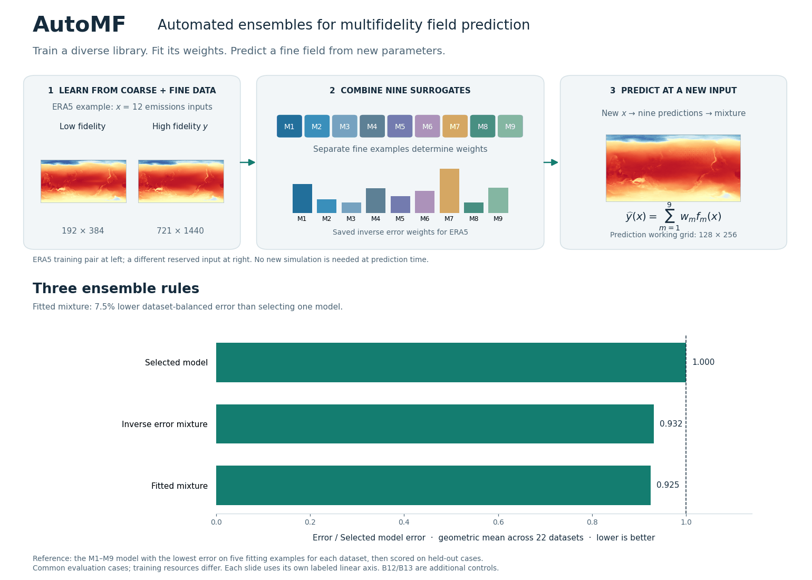
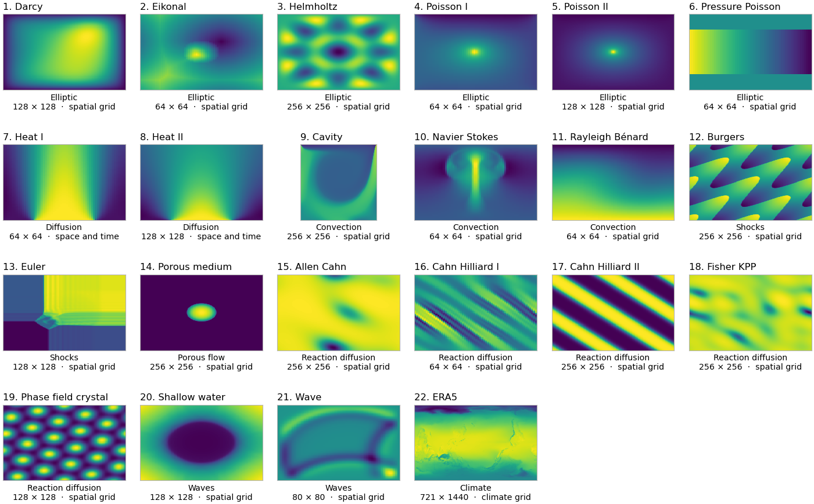

# AutoMF: Automated ensembles for multifidelity field prediction

AutoMF combines coarse and fine training data to build a library of field surrogates, then uses a small set of separate fine examples to fit ensemble weights. At prediction time, the input is a parameter vector **x** and the output is a fine field **y**.

**22 datasets · 9 surrogate models · 11 baseline implementations · 3 ensemble rules**



[Static overview](assets/overview.png) · [Surrogate chart](assets/surrogates.png) · [Baseline chart](assets/baselines.png) · [Results and definitions](docs/RESULTS.md)

## Fit on a new dataset

Use the same `fit` / `predict` workflow for your own parameter vectors and fields. Python 3.12 is recommended. Start with the small CPU example, which trains a model from new arrays and does not need the benchmark downloads:

```bash
GIT_LFS_SKIP_SMUDGE=1 git clone --depth 1 https://github.com/nicksungg/mf_field.git
cd mf_field
python -m venv .venv
source .venv/bin/activate
python -m pip install -e .
python examples/fit_new_dataset.py
```

For the complete nine model library, install the neural dependencies:

```bash
python -m pip install -e '.[neural]'
```

Then supply coarse and fine training arrays:

```python
from automf import FieldDataset, FieldPredictor

data = FieldDataset(
    low_fidelity=(X_coarse, Y_coarse),  # X: (N, d), Y: (N, H, W)
    high_fidelity=(X_fine, Y_fine),
)

predictor = FieldPredictor(path="outputs/my_dataset", models="all").fit(
    data, fitting_size=5, presets="balanced", epochs=100,
)
Y_pred = predictor.predict(X_new)      # Fine fields: (N_new, H_fine, W_fine)
print(predictor.leaderboard())          # Fitting errors and ensemble weights
```

`fit` reserves five fine examples, trains the requested models, and fits their ensemble weights. It removes matching fitting inputs from every coarse training level too. `predict` needs only new parameter vectors. Grid sizes and parameter counts come from your arrays, and your dataset does not need to appear in the benchmark roster.

```python
metrics = predictor.evaluate(X_test, Y_test)  # Scores only, does not refit weights
restored = FieldPredictor.load("outputs/my_dataset")
Y_pred = restored.predict(X_new)
```

Use `models=["M7"]` for the dependency light CPU path. Use `rule="selected"`, `"inverse"`, or `"fitted"` to choose the ensemble rule, with `"fitted"` as the default. To test all nine model adapters with a short training run:

```bash
python examples/fit_new_dataset.py --models all --presets smoke --epochs 2
```

The smoke run checks that the workflow executes. It is not an accuracy benchmark. The new API trains the archived architectures through a common interface. Its training defaults do not reproduce every historical campaign. It does not search over new architectures or use AutoGluon as a dependency.

See [the new dataset guide](docs/NEW_DATASET.md) for array formats, a directory manifest, explicit fitting examples, saving, and supported scope. The API follows the familiar workflow in the [AutoGluon quickstart](https://auto.gluon.ai/stable/tutorials/tabular/tabular-quick-start.html), adapted to field outputs.

## Reproduce the benchmark

The repository also includes a saved prediction example. It fits all three ensemble rules on **five Heat I examples**, then scores **five different examples**, without retraining M1 to M9:

```bash
python -m pip install -r requirements-demo.txt
python scripts/example_ensemble.py
python scripts/reproduce_results.py
```

The reproduction command exports `outputs/results/comparison.csv` and `per_dataset.csv`. Add `--elo` to recompute the Elo rankings. The example uses its own demonstration split. See [full numerical reproduction](docs/REPRODUCIBILITY.md) for the benchmark's reporting splits and replay from per case archives.

## What is being compared?

### The nine surrogates: M1–M9

These are the members of the ensemble library. Each produces a fine field from parameters, including any internally predicted or retrieved coarse reference.

| ID | Surrogate | How it uses the available data |
|---|---|---|
| M1 | FiLM FNO transfer | Parameter conditioning and coarse to fine transfer |
| M2 | All pairs FNO | Fidelity conditioning and training across fidelity pairs |
| M3 | ConvNeXt transfer | Convolutional field decoder with coarse to fine transfer |
| M4 | Distribution FNO | Correction using coarse ensemble distribution summaries |
| M5 | Wavelet transfer | Wavelet field decoder with coarse to fine transfer |
| M6 | Retrieved field DeepONet | Correction of a nearest neighbour coarse training field |
| M7 | POD GP | Fine field basis with Gaussian process coefficients |
| M8 | Slice attention corrector | Iterative correction of a predicted coarse field |
| M9 | ConvNeXt corrector | Convolutional correction of a predicted coarse field |

M7 is a fine only reference. These are **adapted implementations**, with their source methods and changes documented in [model adaptations](docs/MODELS.md). Their use of each fidelity depends on the model. In the new API, M2 uses intermediate coarse targets when at least three fidelity levels are supplied. With only one coarse level and one fine level, its pair training uses fine targets only. See [new dataset details](docs/NEW_DATASET.md).

### Baselines: B1–B11

These are comparison methods. They are evaluated individually and are **not included in the M1–M9 mixture**.

| ID | Baseline implementation | Source method or idea |
|---|---|---|
| B1 | Autoregressive POD GP | Kennedy–O'Hagan autoregression |
| B2 | Nonlinear POD GP | Nonlinear autoregressive multifidelity GP |
| B3 | Composite MF MLP | Composite multifidelity neural network |
| B4 | Composite MF DeepONet | Composite multifidelity DeepONet |
| B5 | Latent MF network | Deep multifidelity active learning |
| B6 | Nonlinear decoder transfer | NOMAD |
| B7 | MFRNP adapter | Multifidelity residual neural processes |
| B8 | Fidelity basis FNO | Infinite fidelity coregionalization |
| B9 | FNO transfer I | Multifidelity FNO transfer |
| B10 | FNO transfer II | A separately archived FNO transfer entry |
| B11 | Affine POD GP | Affine calibration of a coarse surrogate |

**Additional controls:** B12 Parameter kNN and B13 Training mean. Source attribution, adaptation details and shared implementation identities are in [the model guide](docs/MODELS.md). A source citation does not imply an unchanged implementation of the original method.

### Ensemble rules

| Rule | CLI name | How the weights are chosen |
|---|---|---|
| **Selected model** | `selected` | Choose the M1–M9 model with the lowest mean relative L2 error on the fitting examples |
| **Inverse error mixture** | `inverse` | Give more weight to models with smaller mean squared relative errors, then normalize |
| **Fitted mixture** | `fitted` | Jointly fit nonnegative weights that sum to one to minimize combined squared relative error |

Each dataset has its own trained library and weights. **One weight per model applies to every query and spatial cell.** Fitting examples are separate from base-model training and evaluation. Query answers are never used to choose their own prediction weights. The selected model is the reference rule, with all weight on one member.

## Fit an ensemble on your predictions

Prepare `fitting.npz` with `predictions` shaped `(K, M, H, W)` and `targets` shaped `(K, H, W)`. Prepare `queries.npz` with `predictions` shaped `(N, M, H, W)`. Include the same `model_names` string array in both files to check model ordering. The CLI supports any number of models, not just nine.

```bash
python ensemble/fit_fields.py fit --fitting fitting.npz --rule fitted --output weights.json
python ensemble/fit_fields.py predict --predictions queries.npz --weights weights.json --output mixed.npz
```

The output key is `predictions`. Replace `fitted` with `inverse` or `selected` to change the rule. See [input format and example](docs/ENSEMBLES.md).

## Reproduce an individual training run

Install [Git LFS](https://git-lfs.com/) to download array files. For one Heat I experiment:

```bash
git lfs install
git lfs pull --include="datasets/core/heat_generated/**"
python -m pip install -r requirements-training.txt
python scripts/train.py --model M1 --dataset heat_generated --epochs 2500
```

Use a CUDA-compatible PyTorch installation for GPU training. `--model` accepts the IDs above. M8/M9 require coarse-model preparation, and ERA5 uses its unpaired-data adapter. Follow the [training guide](docs/TRAINING.md) for those procedures and exact campaign recipes. To obtain all arrays, run `git lfs pull --include="" --exclude=""` (about 10.4 GB of unique LFS objects).

## Data and code

| Location | Contents |
|---|---|
| [automf/](automf/) · [new dataset guide](docs/NEW_DATASET.md) | `FieldDataset` and `FieldPredictor` for training and prediction on new data |
| [examples/fit_new_dataset.py](examples/fit_new_dataset.py) | Complete example using newly generated scalar fields |
| [datasets/](datasets/) · [dataset guide](docs/DATASETS.md) | 21 PDE datasets across seven classes, plus ERA5 |
| [generators/](generators/) | Dataset generators, parameter recipes and available verification code |
| [models/](models/) · [model guide](docs/MODELS.md) | Baselines and nine surrogates, with common adapters |
| [ensemble/](ensemble/) | Three ensemble rules and fit/predict CLI |
| [campaigns/](campaigns/) | Exact later training recipes, prepared splits and saved outputs |
| [results/](results/) | Saved predictions and raw benchmark records |
| [analysis/](analysis/) | Numerical summaries, per-case archives and reproduction scripts |
| [configs/](configs/) | Dataset roster and model IDs |

<details>
<summary>View all 22 datasets</summary>



</details>

The repository contains code, data and results; the manuscript is maintained separately. Saved predictions support numerical replay, and training code supports new fits. Not every historical trained checkpoint is included. See [reproduction scope](docs/REPRODUCIBILITY.md), [results interpretation](docs/RESULTS.md) and [third-party attribution](docs/THIRD_PARTY_NOTICES.md).
