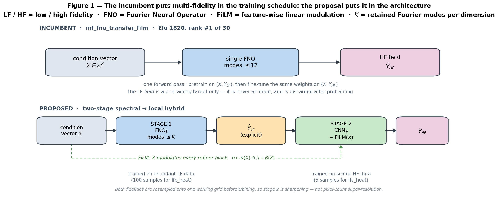

# The FNO→CNN Hybrid for Multi-Fidelity Field Prediction

## How a spectral-then-local two-stage operator works, and whether it is new

*2026-07-21. Prior art in §6 established by a 5-angle literature sweep: 17 primary sources fetched, 85 claims extracted, 25 put to 3-vote adversarial verification, 22 confirmed and 3 killed.*

---

## 1. The proposal in one paragraph

Predict the high-fidelity (HF) field in two stages, splitting the work along the **frequency axis**.

**Stage 1 (spectral, global).**
A Fourier Neural Operator maps the conditioning vector to the *low-fidelity* field:
`FNO_θ : X ∈ ℝ^d → Ŷ_LF ∈ ℝ^{H×W}`.
It is trained on the abundant LF data.
Its Fourier mode budget is set **deliberately low** — see §4.

**Stage 2 (local, high-frequency).**
A convolutional network, conditioned on `X` through FiLM affine modulation, refines that predicted LF field into the HF field:
`CNN_φ : (Ŷ_LF, X) → Ŷ_HF`.
It is trained on the scarce HF data.

The LF field is therefore an **explicit intermediate representation** — a real tensor that flows between the two stages — rather than knowledge implicitly stored in shared weights.



---

## 2. Why this is not what the current leaderboard winner does

It is worth being precise about the difference, because the incumbent sounds superficially similar.

`mf_fno_transfer_film` (Elo 1820, rank #1 of 30 in `model/README.md`) is **one** FNO with the signature `X → field`.
Reading `models/mf_fno_transfer_bar/smoke_eval.py:157-165`, its training is a two-stage *schedule*, not a two-stage *architecture*:

1. Pretrain the network on `(X_lf, Y_lf)` at learning rate `lr_pretrain`.
2. Fine-tune **the same weights** on `(X_hf, Y_hf)` at a lower `lr_finetune`.

At inference it runs `model(X_te) * scaler_hf` — a single forward pass.
The LF *field* is never an input to anything.
It is a pretraining target, and once pretraining ends it is discarded; whatever the model retains of it lives in the weight initialization.

The proposed hybrid differs on three axes:

| | `mf_fno_transfer_film` (incumbent #1) | Proposed FNO→CNN hybrid |
|---|---|---|
| LF field's role | pretraining target, then discarded | explicit intermediate tensor, consumed by stage 2 |
| Architecture | one FNO | FNO + CNN, different inductive biases |
| Where MF lives | training schedule | architecture |
| Representable frequencies | capped at `modes_cap` everywhere | FNO low-k, CNN unbounded-k |

The third row is the substantive one, and §3 is the argument for it.

---

## 3. The mechanism: why split spectral from local at all

### 3.1 What an FNO structurally cannot represent

An FNO's spectral convolution takes an FFT, keeps the lowest `K` modes, applies a learned complex linear map, and inverse-transforms.
In this repository that truncation is explicit (`models/_common/fire_core.py:47`):

```python
mh = min(self.modes_h, max(H // 2, 1)); mw = min(self.modes_w, W // 2 + 1)
```

Everything above mode `K` is **annihilated by construction**.
This is not a tuning deficiency that more training or more width can recover — it is the architecture's range.

How much that costs depends entirely on how fast the field's spectrum decays:

| Field type | Spectral decay | Consequence at K=12 |
|---|---|---|
| Smooth (bump, diffusion) | exponential | truncation near-lossless |
| Chaotic-but-smooth (Kuramoto–Sivashinsky) | exponential past a knee | error floor until K ≈ 40 |
| Sharp interface (Cahn–Hilliard, width ε) | exponential past k ~ 1/ε | floor large whenever the grid under-resolves ε |
| **Discontinuity (shock)** | **only k⁻¹** | **floor ~3×10⁻² even at K=128** |

That last row is the crux.
For a jump discontinuity the Fourier coefficients decay as `k⁻¹`, so the truncated-reconstruction error decays only as `K^{-1/2}` in L2.
**No affordable mode budget fixes a shock.**
Reaching 10⁻³ would need `K` in the thousands, and FNO parameter count scales as `modes_h × modes_w` — quadratically in the very quantity you would be raising.

Figure 2 shows this directly: the three prototypes' spectra against the mode cutoff, with the shock tail's decay exponent fitted rather than asserted.
It measures **−0.96**, i.e. the `k⁻¹` law.
The same argument appears from a different angle in `report_figs_hf/fig_hf1_spectral_wall.png` panel (c) (`MF_Sharp_HighFreq_Report.md` §0.1), which plots the best-possible rel-L2 floor as a function of retained modes.


### 3.2 What a CNN gives you instead

A convolution is a **local** operator.
A 3×3 kernel has a broadband frequency response — it is not band-limited at all.
A step edge is representable exactly in a couple of pixels, and a stack of convs can sharpen a blurred ramp into a jump with a bounded number of parameters that does **not** grow with the highest frequency represented.

The two architectures fail in exactly complementary ways:

- **FNO** — global receptive field from layer one, resolution-flexible, parameter cost independent of grid size; but hard-capped in frequency.
- **CNN** — unbounded in frequency, cheap per-parameter at high k; but a local receptive field, so global structure requires depth, and it is not resolution-invariant.

Stage 1 needs global structure driven by a handful of scalar parameters — that is FNO's strength and CNN's weakness.
Stage 2 needs local sharpening of an already-roughly-correct field — that is CNN's strength and FNO's structural impossibility.

**The division of labor is the design.**

### 3.3 Why the LF field should be an explicit bottleneck

This is a data-economics argument, separate from the spectral one.

Training samples are distributed down the fidelity ladder, with the cheap levels abundant and the expensive level scarce.
`update2.pdf` p.3 gives a per-fidelity breakdown for four datasets, and all four show the same steep decline:

- `ifc_heat` and `ifc_poisson` — **100 / 50 / 20 / 5** across four levels, i.e. a **20:1 LF:HF ratio** with the HF level down to *five* training samples.
- `era5` and `pm_test` — **1222 → 65** across nine levels, again roughly **19:1**.

For the remaining datasets the deck reports a single `N_tr` (400 for most) with no per-fidelity split, so the exact ratio elsewhere is not established by the deck.
Note also that test splits carry HF only (`data_adapters/npz_compat.py`), so `N_te` is an evaluation count and says nothing about HF training supply.

The incumbent's transfer schedule extracts LF value only as an initialization — a weak channel, since fine-tuning is free to destroy it.

Making the LF field explicit changes what each stage has to learn:

- Stage 1 learns `X → Y_LF`, the **hard, high-dimensional** map, with full supervision on the **abundant** data.
- Stage 2 learns only the LF→HF **correction**, a lower-complexity function, from the **scarce** data.

That is the right way round: the large model sits where the data is, and the small model handles the small problem.
It also makes the model **inspectable** — you can look at `Ŷ_LF` and see whether stage 1 or stage 2 is at fault, which no single-network transfer model permits.

### 3.4 Why FiLM specifically

FiLM (Feature-wise Linear Modulation) conditions a network by predicting per-channel scale and shift from the conditioning vector, `h ← γ(X) ⊙ h + β(X)`, instead of concatenating `X` as extra input channels.

The zoo gives unusually clean evidence for it.
`mf_fno_transfer` (#8, Elo 1616) and `mf_fno_transfer_film` (#1, Elo 1820) are **identical except for concat→FiLM**.
That is a controlled ablation with a 200-Elo gap, and `mf_fno_pinn_transfer` (#2) builds on the FiLM variant.

In stage 2, FiLM does something specific: it tells the refiner *what kind of field this is* — which governs where sharp features belong and how sharp they should be — without spending conv channels on a spatially-broadcast copy of `X`.

---

## 4. The mode-budget question, inverted

The natural instinct is that a better model needs *more* Fourier modes, and that measuring the datasets' dominant modes would set the number.

Under this design the conclusion runs the other way.

**First, the grid already caps you.**
`modes(grid, c) = (min(c, H//2), min(c, W//2+1))` (`fire_core.py:147`).
On a 16×16 working grid you get 8 modes no matter what `modes_cap` says.

**Second, most of the suite does not need them.**
`update2.pdf` p.3's `hi-freq` column is **0.00 for roughly 33 of 42 datasets**.
Only `cahn_hilliard_2d` (0.92), `fisher_kpp_1d` (0.40), `kuramoto_sivashinsky_1d` (0.13) and `lid_driven_cavity_generated` (0.09) carry meaningful high-frequency energy.
Where the spectrum is already nearly exhausted by mode 12, raising the cap buys nothing and costs parameters quadratically.

**Third, and most important: raising modes duplicates the refiner's job.**
The whole premise is that the CNN owns everything above the cutoff.
An FNO with `K=40` would be spending quadratically-scaling parameters relearning a band the CNN handles cheaply — and on shocks it would *still* fail, because k⁻¹ decay defeats any budget.

So the FNO cutoff should sit near where **smooth** structure saturates — roughly `K ∈ [8, 16]` — and stage 2 takes it from there.
The mode count becomes a **crossover frequency** between the two stages, not an accuracy knob.

### 4.1 The measurement that would actually settle it

Neither `update2.pdf` nor `MF_Sharp_HighFreq_Report.md` measures the quantity this design depends on: the **radial power spectrum of the HF − LF residual, on the real datasets**.

That residual is precisely what stage 2 must produce, so its spectrum is decisive:

- **Broadband / high-k residual** → the CNN refiner is the right tool; put the crossover at the knee.
- **Low-mode amplitude correction** → a CNN is the wrong tool, and the honest move is to widen the FNO instead.

The second outcome is not far-fetched: `update2.pdf` p.3 reports HF↔LF correlation ≥ 0.93 on most datasets, which is consistent with LF differing from HF by a mild low-order rescaling on much of the suite.

`fig_hf1_spectral_wall.png` is an argument from analytic prototypes — a smooth bump, KS, a Cahn–Hilliard interface at ε=0.01, an Euler Riemann shock — not a measurement of these 42 datasets.
`MF_Sharp_HighFreq_Report.md` §0 says so plainly: *"None of them require running a single experiment."*
It establishes the shape of the answer, not the numbers.

---

## 5. The three risks that would sink it

### 5.1 Exposure bias at the stage boundary

At test time stage 2 consumes `Ŷ_LF` — a *prediction*, carrying stage-1 error.
If it was trained on ground-truth `Y_LF`, it has only ever seen clean input, and its errors compound with stage 1's.

This is the standard two-stage failure and it is avoidable, but only deliberately: train stage 2 on stage 1's own outputs, mix predicted and true LF on a schedule, or train end-to-end after separate warm-up.
It has to be a decision, not an oversight.

### 5.2 The additive-residual dipole

The obvious stage-2 parameterization is `Ŷ_HF = Ŷ_LF + Δ_φ(Ŷ_LF, X)`, with the last layer zero-initialized so training starts at identity and grows the correction — a trick the repo already uses in `fno_coreg_residual`.

`MF_Sharp_HighFreq_Report.md` §0.2 identifies exactly when this backfires.
If the LF solve does not merely *blur* a sharp feature but **misplaces** it — as a first-order Godunov scheme on a 4× coarser grid does to a shock — then `Δ` must cancel one discontinuity and construct another somewhere else.
That residual is a **dipole, larger and sharper than the field itself**: residual learning becomes strictly harder than predicting the field outright, inverting the entire point of residual fusion.

An additive refiner inherits this directly.
The mitigations — align-then-correct, or a direct (non-residual) parameterization — belong in the design, not in a later patch.

### 5.3 The payoff may be concentrated in very few datasets

If ~33 of 42 datasets have zero high-frequency energy, the refiner has nothing to do on them.
There it contributes only extra parameters fitted to a handful of HF samples — as few as **five** on the IFC datasets — a plausible route to *worse* results than the incumbent through overfitting alone.

Because the leaderboard ranks by Elo (per-dataset pairwise wins), winning ~9 sharp datasets while merely tying 33 smooth ones would still move the ranking.
But it must be stated as the expected outcome up front, not discovered afterwards.
A refiner gated to near-identity on smooth datasets — or a family scoped explicitly as a sharp-field specialist — is the honest response.

---

## 6. Prior art

### 6.0 The verdict, stated plainly

**Every individual component of this design is published prior art, and one paper combines three of the four.**

This is not a marginal finding.
The spectral-global-plus-local-convolutional hybrid is established at least six times over across 2021–2026.
The "operator predicts a coarse field, a second network refines it" topology is an established research line with named instances in *Nature Communications Earth & Environment*.
FiLM conditioning of a refiner on a parameter vector — the one element that looked distinctive — is used in exactly the configuration proposed here by a 2025 preprint.

Novelty for this family must therefore be argued on **composition inside a genuine multi-fidelity data regime**, and never on the architecture motif, the truncation motivation, the two-stage topology, or FiLM.

### 6.1 The two near-exact matches

**Park et al., "Bridging Sequential Deep Operator Network and Video Diffusion: Residual Refinement of Spatio-Temporal PDE Solutions"** (arXiv:2507.06133, v1 8 Jul 2025; NCSA/UIUC/NYU Abu Dhabi) is the highest-threat match.
Its stage 1 is a neural operator (S-DeepONet) mapping a prescribed boundary/loading-condition **vector** to a coarse field.
Its stage 2 is a convolutional 3-D U-Net refiner that is **FiLM-modulated channel-wise on that same parameter vector** *and* receives the coarse stage-1 prediction by channel concatenation.

From the paper, verbatim:

> "(i) Physics-input FiLM modulation. The lid-velocity / load function a, identical to the branch input of S-DeepONet, is passed through two linear layers with SiLU activation, yielding a latent code gamma(a). This latent code modulate every feature map channel-wise via FiLM [41] … (ii) Prior-conditioned concatenation. The coarse S-DeepONet prediction x^prior is appended to the noisy input at every diffusion step."

Its stated motivation also matches §3.1 of this report: *"While neural operators such as FNO and DeepONet excel at capturing the global structure of parametric PDE solutions, their spectral bias tends to smear sharp gradients and under-predict fine-scale energy."*

The structural deltas from the proposal are: DeepONet rather than FNO in stage 1; a **stochastic diffusion** objective rather than a deterministic CNN in stage 2; spatio-temporal video rather than a static field; and — decisively — it is **single-fidelity residual sharpening, not LF-solver→HF-solver fusion**, with no transfer schedule.

**SINO** (Qin et al., arXiv:2606.18305, submitted 16 Jun 2026) is the closest match to the *architecture* itself: an explicit spectral-starter → local-convolutional-iterator design, with the starter implemented as an FNO-type spectral block feeding CNN blocks, motivated by precisely the mode-truncation argument.
Verbatim from §2.4:

> "the network integrates a starter module for spectral initialization, which utilizes learnable Fourier filtering to capture low-rank, long-range dependencies and dominant global dynamics as a high-fidelity initial approximation u^(0), and a complementary iterator module for spatial refinement, which employs localized convolutional kernels…"

And from Appendix A.1: *"In the classical FNO framework, approximation accuracy is strictly limited by the choice of the spectral truncation level K… the introduced iterator module progressively compensates for the residual."*

SINO is single-fidelity, jointly trained end-to-end as an unrolled weight-shared iterator rather than two separately-supervised stages, and has no FiLM and no LF/HF schedule.
Note that "high-fidelity" in SINO means *high-accuracy*, not multi-fidelity fusion.

> **Verification note.** A proposed finding that SINO's *absences* "therefore leave the MF / FiLM / transfer novelty intact" was **refuted 0–3** by the adversarial verifiers as an invalid generalization from a single paper. Absence of a feature in one work is not evidence that the feature is unclaimed elsewhere — and Park et al. proves the point for FiLM.

### 6.2 The hybrid spectral + local literature is crowded

At least five peer-reviewed instances beyond SINO establish that "global spectral + local convolution beats either alone":

| Work | arXiv | Venue |
|---|---|---|
| U-FNO (Wen et al.) | 2109.03697 | *Advances in Water Resources*, 2022 |
| U-AFNO | 2406.17119 | *npj Computational Materials* |
| LOGLO-FNO | 2504.04260 | TMLR 12/2025 (J2C certification) |
| HUFNO | 2504.13126 | *Phys. Rev. Fluids* 11, 024601 (2026) |
| WHNO | 2511.07347 | *Journal of Computational Physics* |

**One real distinction survives, and it is thin.** None of these five is a two-stage LF→HF pipeline — they hybridize *intra-layer* (a parallel local branch summed inside the Fourier layer) or by *nesting* (a spectral block in a U-Net bottleneck), not as sequential stages with an intermediate physical field.
But SINO and Park et al. close exactly that gap, so the "ours is two-stage, theirs is intra-layer" argument must contend with those two directly rather than with the table above.

### 6.3 The two-stage coarse-then-refine topology is pre-empted outside multi-fidelity

**NVIDIA CorrDiff** (Mardani, Brenowitz et al.; arXiv:2309.15214, 2023; *Nature Communications Earth & Environment* 6:124, 2025) runs a U-Net regression to a conditional mean at 2 km from a 25 km input, then a diffusion model on the residual `r = x − μ`.
Park et al. itself frames the pattern as pre-existing, naming Lu & Xu (*J. Sci. Comput.* 101(3), 2024) and CorrDiff as "early examples"; LOGLO-FNO cites Oommen et al. 2024 and Fan et al. 2024 for the same.

Critically, **"coarse" in Park et al. and CorrDiff means low-accuracy at the same fidelity, not a cheaper physical solve.**
That distinction is the hinge on which any novelty claim turns — see §7.

### 6.4 The one negative finding that preserves room

Of the six architecture papers checked, **none uses FiLM.**
U-FNO conditions on scalars by broadcast-to-channel and concatenation; LOGLO-FNO appends PDE coefficients as channels; U-AFNO takes only the field; CorrDiff uses concatenation plus an **additive** (not multiplicative) per-channel embedding bias.

Park et al. is the sole verified source using genuine FiLM — which makes citing it unavoidable, and makes **FiLM applied to an FNO** (as opposed to a diffusion/CNN refiner) the one combination that may be genuinely unclaimed.
That said, this was observed as an absence, never searched directly.

### 6.5 The k⁻¹ argument: not found, but do not claim it

Exhaustive full-text greps across the sources found **zero** occurrences of a `k⁻¹` (or `O(1/k)`) coefficient-decay analysis.
Every paper argues the truncation problem *qualitatively*; the closest is WHNO's Gibbs argument plus "algebraic" decay for finite-regularity functions.

**This absence is not novelty.** That a jump discontinuity's Fourier coefficients decay as `O(1/k)` is textbook Fourier analysis.
Frame §3.1 as a quantitative sharpening of an established qualitative argument — never as a new insight.
And do not cite any of these papers *for* the rate; that would be a mis-citation.

### 6.6 What this sweep did **not** verify

Stated so the gaps are not mistaken for clear ground:

- **Item (4) — LF-pretrain → HF-finetune transfer — was never directly verified.** Two anchors surfaced second-hand and should be assumed to fully pre-empt it: **Lyu, Zhao, Gong, Kang & Wen, *Phys. Fluids* 35, 077118 (2023)** (found verbatim in HUFNO's bibliography — and already the acknowledged basis of `mf_fno_transfer` in this repo), and **arXiv:2308.09113**, MF-FNO for geological carbon storage.
- **NO-LIDK** (Liu-Schiaffini et al., ICML 2024), which LOGLO-FNO calls "the FNO-based current state-of-the-art" for localized kernels in neural operators, was not fetched. It is plausibly *tighter* FNO+local-conv prior art than anything verified here.
- **Source-strength asymmetry.** Six anchors are peer-reviewed; the two closest matches are not. SINO is an unrefereed v1 preprint five weeks old with zero citations, and Park et al. has no journal venue found. Both are valid prior art — public disclosure suffices — but must never be cited as peer-reviewed.
- **Time sensitivity.** A near-exact architecture appeared five weeks before this review. Re-run the search before any submission and assume more will land.

---

## 7. What would remain novel

Stated conservatively, and in descending order of how much weight each can bear.

**(a) The composition inside a genuine multi-fidelity data regime — the only claim strong enough to lead with.**
No verified source assembles two-stage operator→refiner *plus* FiLM parameter-vector conditioning *plus* an LF-pretrain/HF-finetune schedule over **physically distinct solvers**: an abundant cheap LF solve and a scarce expensive HF solve.
Every near-exact match — SINO, Park et al., CorrDiff, U-AFNO, U-FNO, LOGLO-FNO, HUFNO, WHNO — is single-fidelity.
The 20:1 LF:HF sample ratio documented in §3.3, with HF down to five samples, is a data regime none of them operates in, and it is what makes the explicit-bottleneck argument bite.

**(b) A deterministic CNN refiner.**
Both closest two-stage matches use stochastic diffusion refiners.
This is a genuine difference, but it is a *weaker* choice on the sharp datasets, not a stronger one: `MF_Sharp_HighFreq_Report.md` §0.3 shows that under MSE/rel-L2 the optimal deterministic prediction of an uncertain sharp feature is the blurred conditional mean.
Diffusion refiners exist in that literature precisely to escape this.
Claiming determinism as a contribution invites the question of why, and the honest answer is "because the benchmark metric rewards it" — which is a statement about the metric, not the method.

**(c) FNO rather than DeepONet or U-Net as the parameter-vector→field stage 1.**
Real but small. It is a backbone substitution within an established topology.

**(d) The k⁻¹ formalization.**
Appears in none of the six sources, but per §6.5 it is textbook and cannot be a contribution.

### 7.1 What this means for the decision

The honest framing is: **this is not a new architecture; it is a known architecture transplanted into a data regime where it has not been tested, and that transplant is the contribution.**

That is a legitimate and publishable claim, but it changes what the work has to do.
It shifts the burden from "show the architecture is clever" to "show the multi-fidelity regime is where the architecture pays off" — which means the baselines are no longer just the zoo's 30 families.
They must include a **single-fidelity ablation of this same two-stage hybrid**, because that is what SINO and Park et al. already demonstrate.
If the two-stage hybrid wins by the same margin without the LF/HF split, the contribution evaporates.

Two open questions gate this and should be resolved before building:

1. **Does Lyu et al. 2023 or arXiv:2308.09113 already pair the LF-pretrain/HF-finetune schedule with any local-convolution refinement stage?** If either does, essentially no architectural novelty remains and only the FiLM+FNO+deterministic-CNN instantiation survives.
2. **In this benchmark, is the LF field a cheaper solver on the same grid, or a coarser grid?** This determines whether the governing prior art is the super-resolution/downscaling line (CorrDiff, Lu & Xu) or the residual-sharpening line (Park et al., U-AFNO) — and therefore which baselines must be beaten. §3.3 and `_to_grid` suggest coarser-grid-then-resampled, which points at the downscaling line, but this was not confirmed against the dataset generators.

---

## Appendix A — Provenance

Claims in this report trace to:

- `update2.pdf` (3 July 2026 deck) — dataset table p.3, sharpness bar chart p.5, methods table p.6, leaderboard p.7, error heatmap p.8.
- `model/README.md` — 30-family Elo leaderboard, per-family TL;DRs.
- `models/mf_fno_transfer_bar/smoke_eval.py` — the transfer-family training and inference path.
- `models/_common/fire_core.py` — shared FNO backbone, mode/grid resolution helpers.
- `MF_Sharp_HighFreq_Report.md` §0.1–0.3 and `report_figs_hf/fig_hf1_spectral_wall.png` — spectral-wall, misalignment-dipole, and blur-preference arguments.

**Not verified in this checkout:** the definition of `update2.pdf`'s `hi-freq` ratio (the generating script is absent from this tree), and any per-dataset spectrum measured from actual data files (`data/` is symlinked to the cluster and dangles locally).

Figures 1 and 2 are reproducible with `report_figs_hybrid/make_fig_hybrid.py`; this document renders to PDF with `report_figs_hybrid/md_to_pdf.py`.

---

## Appendix B — Prior-art sources

Primary sources fetched and verified for §6. Peer-review status is marked because two of the closest matches are unrefereed.

| # | Work | Identifier | Status |
|---|---|---|---|
| 1 | Park et al., *Bridging S-DeepONet and Video Diffusion* | arXiv:2507.06133 (8 Jul 2025) | **preprint — no venue found** |
| 2 | Qin et al., *SINO* | arXiv:2606.18305 (16 Jun 2026) | **unrefereed v1, 0 citations** |
| 3 | Wen et al., *U-FNO* | arXiv:2109.03697 | *Advances in Water Resources*, 2022 |
| 4 | *U-AFNO* | arXiv:2406.17119 | *npj Computational Materials* |
| 5 | *LOGLO-FNO* | arXiv:2504.04260 | TMLR, 12/2025 |
| 6 | *HUFNO* | arXiv:2504.13126 | *Phys. Rev. Fluids* 11, 024601 (2026) |
| 7 | *WHNO* | arXiv:2511.07347 | *J. Computational Physics* |
| 8 | Mardani, Brenowitz et al., *CorrDiff* | arXiv:2309.15214 | *Nature Comms Earth & Env.* 6:124 (2025) |
| 9 | *MF-FNO for geological carbon storage* | arXiv:2308.09113 | **cited second-hand, not fetched** |
| 10 | Lyu, Zhao, Gong, Kang & Wen | *Phys. Fluids* 35, 077118 (2023) | **cited second-hand, not fetched** |
| 11 | Liu-Schiaffini et al., *NO-LIDK* | ICML 2024 | **not fetched — likely tighter prior art** |
| 12 | Perez et al., *FiLM* | AAAI 2018 | the conditioning mechanism itself |

Three claims were **killed** during adversarial verification and are recorded here so they are not resurrected:

1. *"SINO's absences leave the MF / FiLM / transfer novelty intact"* — refuted 0–3 as an over-generalization from one paper.
2. *"HUFNO's motivation is non-periodic boundaries, so the discontinuity argument is non-duplicated"* — refuted 0–3.
3. *"CorrDiff contains no spectral/local hybrid, so it is not prior art for that claim"* — refuted 1–2.
