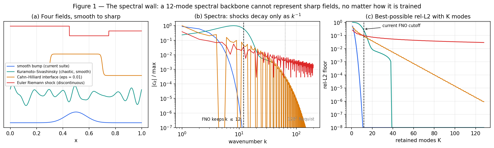
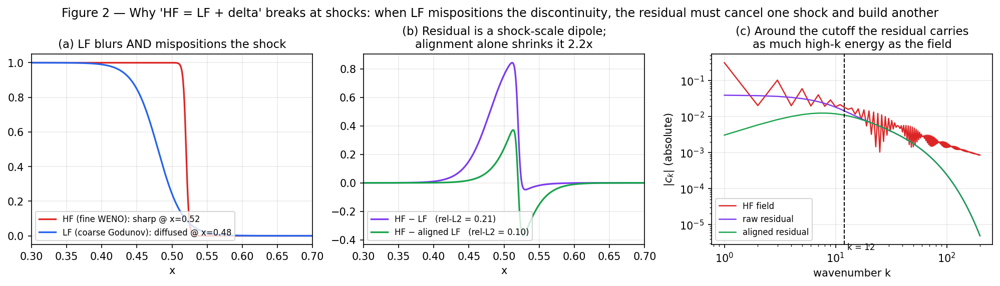
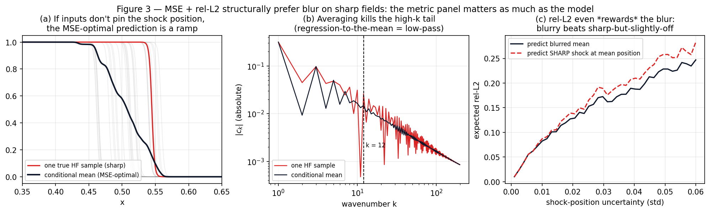

# Multi-Fidelity Field Prediction for Sharp, High-Frequency PDE Solutions

## Research synthesis and model proposals for the SURF-2026 sharp-field datasets

*Prepared 2026-07-02 · companion to `MF_SOTA_vs_MFFP_Report.md` (2026-06-27), which covers the smooth-suite SOTA landscape.*

---

## Executive summary

**The question.** The MFFP zoo's headline result — FNO LF-pretrain → HF-finetune with FiLM conditioning beats all fancier multi-fidelity fusion — was measured on mostly-smooth data.
The SURF-2026 datasets (2-D Euler Riemann shocks, Cahn–Hilliard sharp interfaces, Kuramoto–Sivashinsky smooth control) are designed to test whether it survives high-frequency solution content.
This report synthesizes a deep literature sweep (neural operators, multi-fidelity theory, and six other fields that solved "cheap blurry → expensive sharp" first) into a concrete prognosis and nine ranked, buildable model proposals.

**Finding 1 — the current zoo hits three independent walls on sharp fields, and all three are provable without running anything.**
(i) *Representation*: every FNO family keeps ≤ 12–20 Fourier modes; a shock's spectrum decays as k⁻¹, so truncation alone floors rel-L2 at roughly 3–10 % on shock fields (Fig. 1) — no training fixes this.
(ii) *Fusion rule*: much of the zoo predicts `HF = LF-baseline + δ`; a coarse Godunov LF solve both blurs *and mispositions* shocks, so δ must be a dipole sharper than the field itself (Fig. 2) — the residual problem becomes harder than the original.
Classical MF theory quantifies when this kills the benefit (LF/HF r² ≳ 0.9 needed; even ideal MFMC leaves a fraction 1 − ρ² of the variance), and operator-learning theory proves linear-reconstruction architectures are inefficient on shocks.
(iii) *Objective and metric*: MSE training and rel-L2 ranking both structurally prefer blur — a blurred ramp beats a sharp shock placed slightly off (Fig. 3) — so the SURF metric panel matters as much as any architecture.

**Finding 2 — the benchmark evidence already exists and is unambiguous.**
The Well benchmark measured FNO on `euler_multi_quadrants` — the same PDE family as the SURF Euler dataset — and found spectral models ~2.7× worse than convolutional U-Nets (0.408 vs 0.153 VRMSE).
APEBench and PDEBench show the same FNO-vs-local inversion whenever the spectrum is fully populated.
Expectation: the MFFP leaderboard approximately holds on KS and inverts on Euler/Cahn–Hilliard unless the zoo adapts.

**Finding 3 — the winners currently discard the most valuable sharp-field signal.**
The top transfer families never consume the LF *field* at inference (MF lives only in the pretraining schedule); on sharp data the LF field carries the feature geometry.
The literature's convergent answer — discovered independently by meteorology, seismic imaging, and statistics — is *alignment before correction*: estimate a smooth displacement that registers the LF feature onto the HF position, then correct amplitude.
Transport fields stay smooth even when solutions are discontinuous, so the warp is an easier regression target than the field.
No published MF operator method does this yet; it is the clearest novel-family opportunity in this report (`mf_warp_correct`, P3).

**The proposals (Part 4), in execution order.**
Tier 1 removes known bottlenecks in days: P1 adds a local convolutional path + 32 factorized modes to the winning FiLM-transfer recipe; P2 keeps the architecture and changes only the objective (Charbonnier + gradient-weighted + focal-frequency + frequency-continuation curriculum) — together they answer "representation or objective?" cleanly.
Tier 2 is the MF-specific novelty: P3 warp-then-correct (flagship), P4 audio-style band-splitting (never re-predict what LF resolved), P5 spectral-boosting residual stage.
Tier 3 holds the specialists and bets: P6 level-set interface head for Cahn–Hilliard (sharpness injected analytically), P7 few-step generative refiner with K-sample mean, P8 VQ residual-codebook prior, P9 FAS-multigrid fusion.
Cross-cutting: gradient/shock-indicator input channels, hard-patch mining, and a per-band + displacement/amplitude evaluation panel with the truncation floor as the "perfect model" reference line.

---

## Part 0 — The problem: the benchmark is about to leave FNO's comfort zone

The MFFP benchmark predicts a high-fidelity (HF) 2-D PDE field from abundant cheap low-fidelity (LF) coarse solves, a small condition vector, and scarce HF samples.
Its headline result so far — *"plain FNO LF-pretrain → HF-finetune with FiLM conditioning beats fancier multi-fidelity fusion"* — was measured on a mostly-smooth 17-dataset suite.
The SURF-2026 round adds three datasets arranged along a single frequency-content axis, chosen precisely to stress that result:

| Dataset | Role on the axis | LF recipe | HF recipe | What the LF gets wrong |
|---|---|---|---|---|
| 2-D Euler Riemann | shock (sharpest) | coarse grid, 1st-order Godunov | fine grid, high-order WENO | shocks are *diffused* and *mispositioned* |
| 2-D Cahn–Hilliard | sharp interface | coarse grid under-resolving interface width ε | fine grid resolving ε (h ≲ ε/2) | interfaces blurred, possibly wrong dynamics/topology |
| 2-D Kuramoto–Sivashinsky | smooth control | coarse grid | fine grid | chaotic decorrelation, not sharpness |

Fidelity ladder 32² → 64² → 128², fields read out at a fixed physical time T, LF always a *real consistent coarse solve* (never downsampled HF).

Three first-principles observations say the current model zoo should be expected to degrade on the first two datasets.
None of them require running a single experiment.

### 0.1 The spectral wall (representation)

Nearly every FNO family in the zoo keeps only 12 Fourier modes per dimension (two exceptions reach 16 and 20 — see 0.4; grid Nyquist at 128² is 64).
For smooth fields this is nearly lossless: spectra decay exponentially, and the best-possible 12-mode reconstruction error is far below current leaderboard errors.
For a discontinuity, Fourier coefficients decay only as k⁻¹, so *no training procedure* can push a 12-mode model below a rel-L2 floor of roughly 3–10 % on shock fields — the truncation itself is the bottleneck.
A Cahn–Hilliard interface of width ε sits in between: spectra decay exponentially but only beyond k ~ 1/ε, so the 12-mode floor is large whenever the ladder under-resolves ε (which is exactly how the dataset is designed).

### 0.2 Misalignment breaks additive residuals (fusion rule)

Much of the zoo (FIRE, additive/autoregressive discrepancy, MF-stack, coreg-residual) fuses via `HF = LF-baseline + δ`.
On the Euler datasets the LF solver does not just blur the shock — first-order Godunov on a 4× coarser grid also *moves* it.
When LF and HF disagree about where the discontinuity is, the residual δ must cancel one shock and re-create another: it is a dipole that is *larger and sharper than the field itself*.
The residual learning problem becomes strictly harder than the original field prediction problem — the opposite of what residual fusion is for.
Aligning the LF feature to the HF position *before* correcting shrinks the residual roughly 2× in this toy and, more importantly, removes its high-k dipole structure.

### 0.3 MSE + rel-L2 structurally prefer blur (objective and metric)

All zoo families train with MSE in scaler-normalized space (the Transolver/v9 families add a rel-L2 term), and every leaderboard metric — per-dataset relative-L2, the Elo ranking derived from per-dataset pairwise wins, and the geomean `composite_nRMSE` optimization target — is built on the same L2 distance.
If the inputs do not fully determine the sharp feature's position, the MSE-optimal prediction is the conditional *mean* over plausible positions — a smooth ramp, i.e. blur is not a model failure but the optimum of the objective.
Worse, rel-L2 *rewards* this: a blurred ramp scores better than a razor-sharp shock placed slightly off.
Any model that honestly commits to a sharp answer is penalized by the current primary metric.
This is why the SURF metric panel (spectral error, interface-displacement error, sharpness/total-variation ratios) matters as much as any architecture change, and why this report treats losses/metrics as a first-class design axis alongside architecture.

### 0.4 What this predicts for the current leaderboard

A code-level audit of all families (details in the companion explanations artifact) reduces the zoo to seven fusion archetypes.
Two structural facts dominate the sharp-field prognosis.
First, every FNO family caps retained modes at 12 per axis (16 for `fno_coregionalization`, 20 for `fno_mf_stack`'s HF branch) — 37.5 % of Nyquist on a 64² grid but only ~9 % on a 256² working grid — and every resampling step is bilinear with no anti-aliasing.
Second, and less obvious: **the current winners never look at the LF field at inference.**
The transfer families are pure `X → field` regressions whose multi-fidelity content lives entirely in the pretraining schedule; on smooth data that is enough, because X pins the solution.
On sharp data the LF field is where the feature *geometry* lives (a blurred, slightly shifted picture of the true shock), so families that consume LF at test time get information the winners discard — provided they can fix its misalignment instead of inheriting it additively.

| Archetype (families) | LF at test time? | Sharp-field failure mode | Expected on SURF |
|---|---|---|---|
| Transfer (`mf_fno_transfer[_2m,_film]`) | no — schedule only | 12-mode wall + MSE blur; X must pin the shock position by itself | degrades; stays best-in-zoo if X is informative |
| Physics transfer (`mf_fno_pinn_transfer`) | no (LF X's as collocation) | same, but the FD-residual loss is the zoo's *only* position-exact supervision — Poisson-gated, so inactive on SURF | = FiLM transfer on SURF unless the PINN gate is extended |
| FIRE (`fno_fire_*`, 11 variants) | yes — `HF = μ_LF + δ(σ, q…)` | the additive baseline carries the mispositioned shock; δ must build the Fig.-2 dipole through 12 modes; σ flags position ambiguity only if ensemble members *disagree* — systematic Godunov bias silences it; Gaussian-collapse variants (mdn/laplace/dkl) cannot signal bimodal "shock here or there" | mid-pack, below transfer; distcond best of family |
| Coregionalization (`fno_coreg*`) | no | FiLM-on-m and basis heads are *global* per-channel modulations — no spatially localized correction path | weak |
| Discrepancy/stack (`fno_additive`, `fno_autoregressive`, `fno_multilevel`, `fno_mf_stack`) | model-generated LF only | textbook additive `LF + δ` — precisely the Part-2 negative results; pointwise aggregators cannot shift features | weak; stack's 20 modes help slightly |
| Attention (`transolver_*`, `v9_baseline`) | **yes — real LF tokens** | no spectral truncation and cross-attention *can* re-route a misplaced feature — but all cross-fidelity information squeezes through 16–32 slice tokens, and `transolver_residual`'s soft-NN base (γ=4) is broader-than-bilinear smoothing it must then undo | interesting dark horse; currently bottom-ranked on smooth data |
| DINO (`fno_dino_*`) | internal LF prediction | a single global 768-d CLS vector has zero spatial resolution — cannot correct per-pixel LF error | weak (already an honest negative) |

The concrete prediction: the leaderboard order approximately holds on Kuramoto–Sivashinsky, and inverts on Euler (and Cahn–Hilliard to a ladder-dependent degree), with the transfer families degrading least among FNO families and the LF-consuming attention families closing much of the gap.
Part 1's benchmark evidence (The Well's Euler-quadrant numbers) supports exactly this inversion.

---

## Part 1 — What the neural-operator literature says about high-frequency content

### 1.1 The failure is documented, theoretical, and quantified

Spectral bias — networks learn low frequencies first and high frequencies last — is established at three levels: empirically (Rahaman et al., arXiv:1806.08734; Xu's F-Principle, arXiv:1901.06523), theoretically via NTK eigenvalue decay (Jacot, arXiv:1806.07572; Basri, arXiv:1906.00425), and specifically for FNO (Qin et al., SpecB-FNO, arXiv:2404.07200: FNO's gains concentrate below its truncation frequency and errors grow beyond it — where exactly is dataset- and kernel-dependent — and mode truncation *actively hinders* learning of the remaining high frequencies).
For MFFP the situation is worse than generic spectral bias: 12 retained modes is a *hard representational truncation*, not just slow optimization — content above k=12 can only leak through the 1×1-conv bypass path.

The benchmark evidence is direct and damning for the current backbone on the SURF datasets:

- **The Well** (Ohana et al., NeurIPS 2024 D&B, arXiv:2412.00568) includes `euler_multi_quadrants` — multi-discontinuity 2-D Riemann problems, *the same PDE family as the SURF Euler dataset*.
  One-step VRMSE: FNO 0.408, TFNO 0.416 vs U-Net 0.183, ConvNeXt-U-Net 0.153 — spectral models ~2.7× worse than convolutional ones.
- **APEBench** (Koehler et al., NeurIPS 2024 D&B, arXiv:2411.00180) finds FNO excels only when dynamics concentrate energy in few active modes and struggles on 2-D Burgers when the spectrum is fully populated; it also supplies per-wavenumber-band metrics directly reusable for SURF evaluation.
- **PDE-Refiner's spectral analysis** (Lippe et al., NeurIPS 2023, arXiv:2308.05732) explains the training-side mechanism: per-mode MSE is proportional to amplitude², so low-amplitude high-k bands are statistically ignored by MSE training — independent of architecture.

### 1.2 The remedies, organized by cost

**Free / near-free (schedule and loss changes):**
residual staging — train a second small model on the first model's residual, whose spectrum is flat (multi-stage networks, arXiv:2307.08934; SpecB-FNO, arXiv:2404.07200, ~50 % average error reduction concentrated at non-dominant frequencies);
incremental mode curriculum (iFNO, arXiv:2211.15188);
gradient-weighted supervised losses so interface pixels are not statistically negligible (a transplant of the compression-weighted *residual* idea from discontinuity-computing PINNs, arXiv:2206.03864, to the supervised setting);
radially-binned spectral loss terms (LOGLO-FNO, arXiv:2504.04260).

**Cheap architecture changes:**
add a *local* convolutional path beside the spectral path — the single most consistently validated fix (U-FNO, arXiv:2109.03697, motivated by sharp saturation fronts; localized integral/differential kernels, Liu-Schiaffini et al., ICML 2024, arXiv:2402.16845; DCNO, arXiv:2408.00775);
raise the mode truncation — F-FNO's per-dimension factorized spectral weights cut the parameter cost per retained mode from O(M²) to O(M), so a much higher mode count fits the same 2-D budget (arXiv:2111.13802); SirenFNO goes further and parameterizes the spectral kernel with an implicit network, removing truncation entirely at constant parameter count (arXiv:2606.11518, 2026);
rational activations approximate non-smooth functions exponentially better than ReLU (Boullé et al., NeurIPS 2020, arXiv:2004.01902).

**Backbone replacements:**
alias-free convolutional operators (CNO, Raonić et al., NeurIPS 2023, arXiv:2302.01178 — beats FNO on discontinuous-transport and compressible-Euler benchmarks; ReNO aliasing theory, arXiv:2305.19913) — important for the 32²→128² ladder where naive CNNs alias across resolutions;
wavelet/multiwavelet operators, which localize discontinuities in space *and* scale (WNO, arXiv:2205.02191; MWT, Gupta et al., NeurIPS 2021, arXiv:2109.13459; wavelet-domain diffusion WDNO, ICLR 2025, arXiv:2412.04833);
multigrid and hierarchical-attention operators built for multiscale content (MgNO, ICLR 2024, arXiv:2310.19809; HANO with empirical H1 loss, arXiv:2210.10890);
transformer operators demonstrated on shocks (Transolver on transonic airfoils, ICML 2024, arXiv:2402.02366; finite-regularity transformer analysis including 1-D Euler Riemann, arXiv:2405.19166).

**Generative refinement:**
a deterministic operator predicts the mean structure and a few denoising steps restore the high-frequency tail (PDE-Refiner, arXiv:2308.05732 — tested on Kuramoto–Sivashinsky, the SURF control; Oommen et al., arXiv:2409.08477; caveat about over-degrading high-k on complex spectra: PDESpectralRefiner, arXiv:2506.10711);
or adversarial training of the operator itself (adv-NO, Oommen et al., Nature Communications 2026, arXiv:2509.08752 — ~15× energy-spectrum-error reduction on Schlieren-jet super-resolution at deterministic inference cost; separately, its 3-D turbulence forecaster trains from only ~160 timesteps of a single trajectory).

**Shock-specific operator learning exists and works** (single-fidelity so far): RiemannONets for extreme-ratio Riemann problems (arXiv:2401.08886), Fusion-DeepONet for data-efficient shocked flows (arXiv:2501.01934), learned shock sensors and WENO weights usable as input featurization (arXiv:2308.00086; Rational-WENO, arXiv:2409.09217).

### 1.3 The prediction

The literature is consistent: the FNO-vs-local ranking *inverts* on shock and fully-populated-spectrum data (The Well, APEBench, PDEBench, CNO benchmarks all show it).
The expectation for SURF-2026 is therefore concrete: the current leaderboard order should approximately hold on Kuramoto–Sivashinsky and invert on Euler and (ladder-dependent) Cahn–Hilliard — unless the zoo adopts local paths, more modes, sharp-aware losses, or residual staging.

---

## Part 2 — What the multi-fidelity literature says about discontinuous and misaligned LF/HF pairs

The MF literature has known about the Part-0.2 pathology for a long time, has quantified when it becomes fatal, and points consistently at one family of fixes: *alignment/transport mechanisms rather than bigger residuals*.

### 2.1 Classical MF: quantified failure thresholds for additive fusion

Kennedy–O'Hagan co-kriging (`y_HF = ρ·y_LF + δ`, Biometrika 2000) puts a smooth GP prior on δ — exactly what a mispositioned discontinuity violates.
Toal's empirical guideline (Struct. Multidisc. Optim. 2015, DOI 10.1007/s00158-014-1209-5) is blunt: MF kriging needs LF/HF correlation r² ≳ 0.9 to beat single-fidelity at all.
Multi-fidelity Monte Carlo makes the same point exactly: in the ideal cheap-LF limit it still leaves a fraction 1 − ρ² of the variance unreduced (Peherstorfer, Willcox & Gunzburger, SIAM J. Sci. Comput. 38(5), 2016), so as LF/HF decorrelate — whether from shocks or chaos — the benefit of the LF model vanishes.
The classical escape routes are NARGP — feed the LF *value* as a nonlinear input to the HF model instead of assuming an additive relation (Perdikaris et al., Proc. R. Soc. A 2017, DOI 10.1098/rspa.2016.0751) — and deep MF GPs that learn an input *warping* before co-kriging, claimed explicitly to survive "discontinuous cross-correlations" (Raissi & Karniadakis, arXiv:1604.07484).

### 2.2 The misalignment fix has three independent discoveries

Three separate communities converged on "decompose the error into displacement + amplitude, and fix displacement first":

- **Meteorology** (30 years ago): forecast verification decomposes error into displacement + amplitude + residual (Hoffman et al., Mon. Wea. Rev. 1995), and the DAS score explicitly morphs the forecast onto the observation with an optical-flow field before scoring amplitude (Keil & Craig, Wea. Forecasting 2009) — because pixel metrics double-penalize a correct-but-displaced feature.
  Field-alignment data assimilation solves for a smooth displacement before any amplitude correction (Ravela, Emanuel & McLaughlin, Physica D 2007).
- **Seismic FWI**: W2/optimal-transport misfits are provably convex under translations, fixing cycle-skipping (Engquist & Yang, CPAM 2022, arXiv:2002.00031) — see Part 3.4.
- **Statistics**: elastic Bayesian calibration splits misaligned functional responses into aligned functions (amplitude) plus warping functions (phase) and emulates the two *separately* (Francom et al., arXiv:2305.08834).

Transonic aerodynamics — the industrial home of shock-dominated MF — did the same in domain-specific form: shape-preserving response prediction corrects a cheap pressure distribution by *translating its characteristic points* (shock location, suction peak) to match HF (Leifsson & Koziel, J. Comput. Science 2010), and manifold-alignment MF ROMs Procrustes-align LF and HF snapshots in latent space (Perron, Rajaram & Mavris, Proc. R. Soc. A 2021).

### 2.3 Operator learning: a theorem, and the current MF gap

Lanthaler, Molinaro, Hadorn & Mishra (ICLR 2023, arXiv:2210.01074) prove lower bounds: operator architectures with *linear reconstruction* (DeepONet, PCA-Net) are provably inefficient at approximating discontinuous solution operators, and their fix — shift-DeepONet, which learns input-dependent *shifts* — is an alignment mechanism.
The registration-based ROM line supplies the key structural fact for model design: **transport/displacement fields stay smooth even when the solutions they transport are discontinuous** (Nair & Balajewicz, arXiv:1712.09144; Taddei's registration ROMs; FFT cross-correlation registration, Gowrachari et al., arXiv:2501.01299), so the warp is an *easier* regression target than the field.
Existing MF operator work, by contrast, is essentially all transfer learning (Tang et al., arXiv:2308.09113 — the MFFP baseline's namesake) or composite linear+nonlinear correction nets (Howard et al., arXiv:2204.09157); none of it addresses feature misalignment — the exact gap the SURF datasets will expose.
Closest recent relatives: multi-fidelity flow matching for cascaded PDE refinement (arXiv:2605.16118, 2026), OT displacement-interpolation MF ROMs applied to *diffuse-interface two-phase flows* — nearly the Cahn–Hilliard setting (Khamlich et al., arXiv:2603.04232, 2026), and explicit shock-geometry networks (NDNN, arXiv:2405.15559; shock-detection CNNs, Beck et al., arXiv:2001.08201).

### 2.4 Chaotic LF/HF pairs: the KS control has its own theory

For chaotic systems there is a *provable* accuracy limit for pointwise closure/correction learning once coarse and fine trajectories decorrelate (Wang et al., arXiv:2408.05177, NeurIPS-line 2024).
Within a few Lyapunov times the LF field still carries usable phase information; beyond that, the optimal pointwise predictor collapses to the conditional mean and only *statistics* (spectra, invariant measures) remain predictable — the community's response is invariant-measure-preserving losses (Sinkhorn on summary statistics, tested on KS specifically: Jiang et al., arXiv:2306.01187; DySLIM, arXiv:2402.04467) and LF-conditioned generative models that sample the HF conditional distribution rather than regress it (Geneva & Zabaras, arXiv:2006.04731).
Practical corollary for MFFP: on the KS dataset the readout time T relative to the decorrelation horizon decides whether MF conditioning helps at all — worth measuring before blaming any model.

### 2.5 The negative results, collected

Four independent formal results all disadvantage the additive-residual pattern on the new datasets:
AR1 needs r² ≳ 0.9 (Toal 2015); MFMC's best-case leftover variance is 1 − ρ², so its benefit vanishes under decorrelation (Peherstorfer 2016); linear-reconstruction operator learning has shock lower bounds (Lanthaler 2022); pointwise correction learning has a chaos limit (Wang 2024).
The literature's arrow points at alignment/transport, LF-as-input conditioning, discontinuity-aware features, and (for chaos) statistics matching.

---

## Part 3 — Ideas from fields nobody in MF-for-PDEs is looking at

Half a dozen other fields have spent decades on exactly this problem — *"given a cheap blurry version of a signal plus a few expensive sharp examples, synthesize the sharp version"* — and their hard-won lessons transplant surprisingly directly.
One caveat threads through everything below: MFFP is scored on rel-L2, and for MSE-type metrics the blurry conditional mean is *optimal* unless the LF input mispositions sharp features (Part 0.3).
So the transplants with the highest expected value are the ones that (a) fix *position/phase* errors, (b) sharpen deterministically, or (c) use generative models via a K-sample posterior *mean*, not single-sample realism.

### 3.1 Cosmology and turbulence: hallucinate detail, validate on spectra

Cosmologists super-resolve N-body simulations by *accepting* that small scales are not deterministically recoverable: a GAN or diffusion model samples statistically-correct small-scale structure conditioned on the large scales, and validation is on *summary statistics* — power spectra to percent level, halo mass functions — not pixels (Li et al., PNAS 2021, arXiv:2010.06608; Ni et al., arXiv:2105.01016; Schanz, List & Hahn diffusion variant, arXiv:2310.06929).
Turbulence went through the same arc: L2-trained CNN super-resolution oversmooths (Fukami, Fukagata & Taira, JFM 2019, arXiv:1811.11328), adversarial training recovers correct energy spectra and small-scale gradients (PIESRGAN, Bode et al., arXiv:1911.11380; ablation in arXiv:2308.16015), and a 2026 Nature Communications result (adv-NO, arXiv:2509.08752) reports ~15× energy-spectrum error reduction over L2 training on Schlieren-jet super-resolution, *at neural-operator inference cost*.
Physics-informed residual diffusion (PiRD, arXiv:2404.08412) shows a ~20-epoch / ~20-sampling-step recipe — cheap enough for the MFFP smoke budget.

**Transplants.**
(1) *Scale-reweighted ("filter-boosted") loss*: split `pred − target` into ~4 radial FFT bands and reweight each band's MSE by the model's current per-band error — a 20-line change to any family.
(2) *adv-NO recipe*: keep the FNO, pretrain with MSE, then ramp in a small multi-scale patch discriminator (λ ≈ 1e-3) as a "sharpener".
(3) *Spectrum diagnostics*: log radial power spectra of predictions vs HF in the results JSON regardless of model — it is the cosmology field's whole validation methodology and directly answers "how far from a perfect model are we, per scale".

### 3.2 Computer-vision super-resolution: the blur problem is solved, three different ways

Vision documented regression-to-the-mean blur precisely (SRGAN, Ledig et al., arXiv:1609.04802) and offers three fixes at three costs.
*Loss reweighting*: focal frequency loss (Jiang et al., ICCV 2021, arXiv:2012.12821) dynamically upweights the spectrum bins the model currently gets wrong — still an L2, so it cannot trade away rel-L2 the way GAN losses can; Charbonnier loss regresses toward a conditional *median*, which stays much sharper than the mean under position jitter.
*Architecture*: Laplacian-pyramid networks (LapSRN, Lai et al., arXiv:1704.03915) predict per-band residuals with deep supervision per level; LIIF (Chen, Liu & Wang, arXiv:2012.09161) decodes any continuous coordinate from local features — directly relevant since MFFP's fidelities live on different grids and bilinear resampling injects blur before training even starts.
*Objective family*: full generative SR (SR3 diffusion, arXiv:2104.07636) — the perception–distortion tradeoff means this only pays under the SURF metric panel, not under rel-L2 alone.

### 3.3 Audio bandwidth extension: never re-predict what the cheap signal already got right

Bandwidth-extension systems *copy* the observed low band verbatim and generate only the missing high band (AP-BWE, arXiv:2401.06387); GAN vocoders succeeded via multi-scale discriminators (HiFi-GAN, arXiv:2010.05646) and the multi-resolution STFT loss (Parallel WaveGAN, arXiv:1910.11480) — sums of spectral-convergence and log-magnitude terms over several window sizes.
**Transplant**: a band-split FNO that hard-constrains the output's low Fourier band to (a lightly corrected) LF spectrum and predicts only coefficients above a cutoff k_c, with k_c estimated per dataset as the wavenumber where LF/HF cross-spectral coherence drops below ~0.7 — computable from the scarce HF pairs in one pass.
This encodes the exact MF prior "the LF solve is correct where it resolves, absent above" — with the caveat that low-band *phase* errors from mispositioned shocks make the low-band correction term load-bearing.

### 3.4 Seismic imaging: the misalignment problem has a 30-year-old industrial solution

Full-waveform inversion hits the *identical* pathology MFFP will hit on Euler: an L2 misfit between two misaligned sharp wavefields double-penalizes (once where the feature is, once where it should be) and creates cycle-skipping local minima.
The two industrial fixes are (a) *frequency continuation* — fit low-pass-filtered data first and progressively admit higher frequencies (Bunks et al., Geophysics 1995), and (b) *optimal-transport misfits* that are provably convex under translation (Métivier et al., GJI 2016; graph-space OT, Geophysics 2018; Engquist & Froese's W2 line).
**Transplants**: a low-pass-ramped target schedule (an FFT mask on the training target, ~5 lines), and an OT or soft-warp auxiliary loss that turns "shock 3 px left" from a double-count L2 penalty into a small transport penalty whose gradient *moves* the shock.

### 3.5 Numerical-analysis classics: four theorems waiting to be architectures

- **Multigrid Full Approximation Scheme**: the LF/HF relationship *is* coarse-grid correction, and FAS defines exactly "what the coarse solver got wrong" (the τ-correction) as an operator-equation defect — not an image residual (learned analog: MgNet, He & Xu, arXiv:1901.10415).
- **WENO**: nonlinear stencil selection refuses to interpolate across a discontinuity; a learned prolongation that softmax-selects among one-sided stencils would upsample LF without smearing shocks (WENO-NN precedent: Stevens & Colonius, arXiv:2002.02521).
- **Gegenbauer / Gibbs-defeating reprojection** (Gottlieb & Shu, SIAM Review 1997): a *theorem* that from truncated spectral coefficients of a piecewise-analytic function plus known edge locations, high — in the analytic case exponential — accuracy is recoverable within each smooth region.
  FNO outputs are truncated spectra — so a learned edge detector plus a reprojection layer could de-Gibbs them in a principled way.
- **Curvelets/shearlets** (Candès & Donoho 2004; Kutyniok & Lim, arXiv:1002.2661): anisotropic frames are provably near-optimal for cartoon-like functions with C² edges — N⁻² approximation decay up to log factors, vs wavelets' N⁻¹; a shearlet neural operator for shock-dominated PDEs already exists (arXiv:2604.25181, 2026).

### 3.6 Graphics and face restoration: detail is a *dictionary*, not a regression

Graphics stores high-frequency detail separately from base structure (displacement maps since 1984) and synthesizes it by exemplar lookup (Image Analogies, Hertzmann et al., SIGGRAPH 2001).
Face restoration's CodeFormer (Zhou et al., NeurIPS 2022, arXiv:2206.11253) casts severely ill-posed sharpening as *classification over a small learned codebook* of high-quality structures — a far stronger prior than regression when data is scarce and structure is stereotyped.
**Transplant**: shock and interface cross-sections are exactly as stereotyped as facial features (a Cahn–Hilliard interface profile is literally a universal tanh; shock jumps are self-similar).
A patch dictionary or small VQ codebook of HF residual patches, indexed by LF patch features and blended through a learned confidence gate, is nearly training-free and extremely sample-efficient — each HF field donates ~10³ training patches.

### 3.7 Physics: RG and homogenization say what LF actually *is*

Renormalization-group theory says coarse-graining destroys information, so inverse coarse-graining is *necessarily stochastic* — matching the cosmology lesson (Koch-Janusz & Ringel, Nature Physics 2018, arXiv:1704.06279).
Homogenization theory says something sharper: a coarse solver does not compute "the true field, blurred" — it solves a *different effective equation*, and the fine-scale corrector is slaved to the *gradient* of the coarse solution (`u_ε ≈ u_0 + ε χ(x/ε)·∇u_0`).
**Transplant (a feature-engineering theorem)**: feed ∇LF and Hessian invariants as explicit input channels, and predict residuals in a locally rotated frame aligned with ∇LF so one parameterization serves all shock orientations — an equivariance prior that multiplies the effective HF sample count.

### 3.8 Grab bag

- *Phase vs amplitude* (video interpolation, PhaseNet, CVPR 2018): position lives in local phase, energy in amplitude; predicting per-band phase corrections + amplitude gains in a steerable pyramid turns misposition errors into small phase deltas — the architectural twin of the OT loss.
- *Hard-patch mining* (deep demosaicing, Gharbi et al., SIGGRAPH Asia 2016): importance-sample training crops by per-patch loss; on sharp datasets ~10 % of pixels carry ~90 % of the error, so this is free lunch under a 30-min budget.
- *Unrolled deconvolution with a learned prior* (galaxy deblurring, Li & Alexander, arXiv:2211.01567): fit the actual LF↔HF transfer kernel from training pairs (one FFT pass), then unroll a few proximal-gradient steps with the FNO as the learned prox — the physics carries most of the weight in the low-data regime.
- *The crossover has started*: SpecB-FNO residual stacking against spectral bias (arXiv:2404.07200), diffusion posterior correction of operator spectral bias (arXiv:2606.03936), shearlet neural operators (arXiv:2604.25181), adv-NO (arXiv:2509.08752) — evidence this direction is timely, and the bar to beat.

---

## Part 4 — Proposed model families, ranked

Everything below fits the repo contract: `models/<family>/` with `manifest.json` + `smoke_eval.py`, shared `data_adapters` loaders, checkpoint resume, ≤ 30 min smoke on one H100, and an `INSPIRATION.md` citing the papers given here.
The ranking optimizes expected leaderboard value per unit of implementation risk, respecting the repo doctrine of *one mechanism per family* so ablations stay clean.

### Tier 1 — bank shots: remove the known bottlenecks first

**P1. `mf_fno_transfer_local` — add a local path and more modes to the winning recipe.**
Take the FiLM-transfer recipe unchanged (same FiLM conditioning, same LF-pretrain → HF-finetune schedule; `mf_fno_transfer_film` itself lives in the cluster working tree — in this checkout `mf_fno_pinn_transfer` minus its physics term is the identical architecture and serves as the template) and change only the backbone block: modes 12 → 32, per-dimension factorized spectral weights (F-FNO, arXiv:2111.13802) to keep parameters flat, plus a parallel 2-layer depthwise-conv branch (3×3, dilation 1 and 2) added to each block's output.
Rationale: this removes the representation floor of Fig. 1 and adds the local path that The Well's Euler numbers say matters most (arXiv:2412.00568); every ingredient is ESTABLISHED.
Risk: low; cost: days.
Expected: the single largest sharp-dataset gain available; little or no change on the smooth suite (watch for small-data overfitting from extra modes — the factorization plus parameter matching controls this).

**P2. `mf_fno_transfer_sharploss` — same architecture, sharp-aware objective.**
Identical to `mf_fno_transfer_film`; change only the loss and schedule: Charbonnier instead of MSE; gradient-weighted pixel loss (weight map = normalized |∇LF|, available at inference); focal-frequency term (arXiv:2012.12821); frequency-continuation curriculum (supervise against low-pass-filtered HF with the cutoff ramped up over the first third of epochs — Bunks et al. 1995).
Rationale: isolates "is it the representation or the objective?" — the cleanest scientific complement to P1.
Risk: minimal (loss-only); cost: 1–2 days.

### Tier 2 — the multi-fidelity-specific novelty

**P3. `mf_warp_correct` — align, then correct (the flagship proposal).**
Forward pass: `HF_pred = warp(up(LF), w_θ) + δ_θ`, where `w_θ` is a *smooth* 2-channel displacement field predicted by a small FNO head (zero-initialized, smoothness-penalized) applied via differentiable `grid_sample`, and `δ_θ` is the usual FiLM-conditioned residual FNO.
Optional warm-start: precompute optical-flow displacement targets between paired up(LF)/HF training fields (Keil & Craig-style, DIS or Horn–Schunck) and supervise `w_θ` directly for the first epochs, decoupling the ill-posed joint optimization.
Rationale: this is the mechanism Part 2's entire literature arrow points at — transport fields stay smooth even when solutions are discontinuous (arXiv:1712.09144), shift-mechanisms provably fix operator learning on shocks (arXiv:2210.01074), and no published MF *operator* method does it yet.
Zero-init means it degrades gracefully to plain additive correction on the smooth suite.
Risk: medium (joint warp+residual training can be finicky — the warm-start mitigates); cost: ~1 week.
This is also a *publishable* family: "registration-based multi-fidelity operator learning" fills a documented gap.

**P4. `mf_band_split` — never re-predict what the LF solver already resolved.**
Hard-constrain the output's Fourier coefficients below a per-dataset cutoff k_c to (a lightly corrected version of) the up-sampled LF spectrum; the network predicts only k > k_c coefficients plus the small low-band correction.
Estimate k_c in one pass from training pairs as the wavenumber where LF/HF cross-spectral coherence drops below ~0.7.
Train with a 2-D multi-resolution spectral loss (windowed-FFT spectral-convergence + log-magnitude terms over window sizes {8,16,32,64} — the Parallel WaveGAN loss, arXiv:1910.11480).
Rationale: the audio-BWE prior maps exactly onto the MF setting; concentrates scarce HF supervision on the genuinely missing band.
Risk: medium — low-band *phase* errors from mispositioned shocks make the correction term load-bearing (P3 fixes what P4 assumes away; they compose naturally).
Cost: ~3–4 days.

**P5. `mf_specb_residual` — spectral-boosting second stage.**
Freeze the best trained transfer model; train a second small FNO (or conv-net) on its residual, whose spectrum is flat rather than red (SpecB-FNO, arXiv:2404.07200; multi-stage networks, arXiv:2307.08934).
Rationale: purpose-built for "the first model got the smooth part; the residual is the sharp part"; trivially fits the budget since stage 2 is small.
Risk: low; cost: 2–3 days.
Watch: stage-2 must see LF-derived shock-location features (|∇LF|, WENO smoothness indicators as channels) or it inherits the same spectral bias on a harder target.

### Tier 3 — dataset specialists and bolder bets

**P6. `mf_interface_levelset` — geometry head for Cahn–Hilliard (shock-fitting philosophy).**
Predict a smooth signed-distance-like field φ(x) and smooth bulk amplitudes (A, B), then compose analytically `u = A·tanh(φ/ε) + B` with ε taken from the condition vector.
The network only ever regresses *smooth* targets; the sharpness is injected analytically, so the spectral wall never applies.
Follows the repo's `mf_fno_pinn_transfer` pattern of dataset-conditional specialization (falls back to plain transfer off-CH).
Precedents: implicit shock tracking (Zahr et al.), NDNN (arXiv:2405.15559), OT-interpolation MF ROMs for diffuse-interface two-phase flows (arXiv:2603.04232).
Risk: medium (topology changes; φ supervision needs an interface extraction step on HF training fields); cost: ~1 week; ceiling on CH: very high.

**P7. `mf_gen_refiner` — few-step denoising refinement with K-sample mean.**
Deterministic FiLM-transfer prediction, then 2–4 PDE-Refiner-style denoising steps conditioned on it (arXiv:2308.05732); at eval, average K ≈ 8 samples (posterior mean) so rel-L2 does not regress, and log radial spectra as diagnostics.
Rationale: the only approach that can *honestly* restore the high-k tail when the missing detail is not deterministically recoverable (RG/cosmology argument); wins big under the SURF metric panel even where rel-L2 ties.
Risk: medium-high under a 30-min budget (PiRD's ~20-epoch recipe, arXiv:2404.08412, says it fits); cost: ~1 week.

**P8. `mf_patch_codebook` — discrete residual prior (the creative bet).**
Train a small VQ codebook (~512 × 64-d) of HF-residual patches around high-|∇LF| locations, plus a lightweight transformer/CNN that predicts code indices from LF patch features; blend decoded residual patches through a learned confidence gate over the FNO baseline.
Rationale: shock and interface cross-sections are as stereotyped as facial features (a CH interface profile is literally a universal tanh), and classification-over-codebook beats regression under scarce data (CodeFormer, arXiv:2206.11253); each HF field donates ~10³ training patches, so the HF-scarcity constraint is side-stepped.
Risk: high (novel composition, gate must be trustworthy); cost: ~1 week; genuinely novel family if it works.

**P9. `mf_fas_multigrid` — treat LF as an operator defect, not an image.**
Unroll 2–3 FAS two-grid cycles: restrict the current HF estimate, compute the defect against the *actual LF solve* (the learned τ-correction), map it through a small FNO, prolong with a learned WENO-style prolongation (softmax over one-sided stencils so upsampling never averages across a shock), smooth with two conv layers.
Precedents: MgNO (arXiv:2310.19809), MgNet (arXiv:1901.10415), WENO-NN (arXiv:2002.02521).
Risk: medium-high (engineering across `resolve_grid` geometries); the conceptually deepest use of multi-fidelity structure in the list.

### Cross-cutting recommendations (apply regardless of family)

1. **Input featurization**: feed `|∇LF|`, WENO smoothness indicators, and a van Cittert-deconvolved LF channel everywhere — homogenization theory says missing fine structure is slaved to coarse gradients; near-zero cost.
2. **Hard-patch mining**: importance-sample training crops by per-patch loss; on sharp fields a small fraction of pixels carries most of the error, so this reallocates the 30-min budget to where it pays.
3. **Evaluation panel** (aligns with the planned SURF metric panel): per-wavenumber-band error E(k) (APEBench-style), displacement/amplitude decomposition (optical-flow DAS score), total-variation ratio (sharpness preservation), and the *truncation floor* of Fig. 1c as the "perfect 12-mode model" reference line.
4. **Diagnose before modeling**: compute per-dataset LF/HF correlation (Toal's r² ≳ 0.9 criterion), cross-spectral coherence vs k, and — for KS — decorrelation at the readout time T.
   These three numbers predict where MF fusion can help at all and will explain the leaderboard shifts before any model is trained.

### Suggested execution order

P1 + P2 first (days, low risk, immediately answer "representation vs objective"), P3 + P5 next (the novel MF mechanisms), then P4, P6 for dataset-specific pushes, and P7–P9 as research bets once the SURF sample round lands.

---

## Part 5 — Answers to the open questions in QUESTIONS.md

**Q1 — "How well are the models performing; how do I visualize best-model vs perfect-model?"**
Three visualizations, in increasing order of insight:
(a) *Distance-to-floor*: plot each family's per-dataset rel-L2 against the best-possible K-mode truncation floor (Fig. 1c) — on smooth datasets the gap to zero is all "model error"; on sharp datasets much of it is representation floor, which no training fixes.
(b) *Per-band spectral error* E(k) = |F(pred) − F(HF)|²/|F(HF)|² radially binned — shows exactly which scales a model wins or loses; a perfect model is a flat zero line, and the APEBench tooling (arXiv:2411.00180) provides the recipe.
(c) *Displacement + amplitude decomposition*: morph the prediction onto HF with optical flow, report displacement magnitude and post-morph amplitude error separately (Keil & Craig 2009) — this splits "sharp but misplaced" from "blurred" — two failure modes rel-L2 conflates.

**Q2 — "How do the models work / how to build one for high-frequency solutions?"**
The per-component explanations are in the companion artifact (`model_explanations.html`, lavish + static); the high-frequency answer is this report, Parts 0–4.

**Q3 — "What if we use RL — the Elo thing reminds me of RL."**
The Elo–RL resemblance is superficial: Elo here is an *evaluation* aggregator (pairwise win-rates over datasets), not a reward signal being optimized by an agent.
As a predictor, RL replaces exact per-pixel gradients with high-variance policy-gradient estimates and is strictly dominated by differentiable training for dense field regression.
Where RL genuinely belongs in multi-fidelity work is the *acquisition problem* — which fidelity to query, where, and when, under a budget — but MFFP's fixed data splits remove that problem by design.
The defensible middle ground (an RL-flavored curriculum over HF sample emphasis) is likely matched by uncertainty-weighted losses, which are differentiable and cheaper — the FIRE families' σ-fields already provide the weight map.
If the SURF round ever adds an active data-generation loop (choosing which Riemann configurations to solve at HF next), multi-fidelity Bayesian optimization / bandit acquisition is the right tool — that is where the RL instinct pays off.

---

## Part 5 — Answers to the open questions in QUESTIONS.md

*(best-vs-perfect-model visualization; RL note)*

---

## References (selected primary sources)

Inline arXiv IDs throughout the text are the citation of record; this list collects the load-bearing ones.

**Spectral bias and FNO limits.**
Rahaman et al., "On the Spectral Bias of Neural Networks," 2019, arXiv:1806.08734.
Xu et al., "Frequency Principle," 2019, arXiv:1901.06523.
Qin et al., "Toward a Better Understanding of Fourier Neural Operators from a Spectral Perspective" (SpecB-FNO), 2024, arXiv:2404.07200.
Lippe et al., "PDE-Refiner," NeurIPS 2023, arXiv:2308.05732.

**Benchmarks with sharp content.**
Ohana et al., "The Well," NeurIPS 2024 D&B, arXiv:2412.00568.
Koehler et al., "APEBench," NeurIPS 2024 D&B, arXiv:2411.00180.
Takamoto et al., "PDEBench," 2022, arXiv:2210.07182.

**High-frequency-capable operators.**
Wen et al., "U-FNO," 2021, arXiv:2109.03697.
Tran et al., "Factorized FNO," 2021, arXiv:2111.13802.
Liu-Schiaffini et al., "Neural Operators with Localized Integral and Differential Kernels," ICML 2024, arXiv:2402.16845.
Raonić et al., "Convolutional Neural Operators," NeurIPS 2023, arXiv:2302.01178.
Gupta et al., "Multiwavelet-based Operator Learning," NeurIPS 2021, arXiv:2109.13459.
He et al., "MgNO," ICLR 2024, arXiv:2310.19809.
Liu et al., "HANO / mitigating spectral bias," 2022, arXiv:2210.10890.
Peyvan et al., "RiemannONets," 2024, arXiv:2401.08886.
Wu et al., "Transolver," ICML 2024, arXiv:2402.02366.
Oommen et al., "Learning Turbulent Flows with Generative Models" (adv-NO), Nature Communications 2026, arXiv:2509.08752.

**Multi-fidelity theory and misalignment.**
Kennedy & O'Hagan, Biometrika 87(1), 2000.
Toal, Struct. Multidisc. Optim. 51, 2015, DOI 10.1007/s00158-014-1209-5.
Perdikaris et al., "NARGP," Proc. R. Soc. A 473, 2017, DOI 10.1098/rspa.2016.0751.
Peherstorfer, Willcox & Gunzburger, "Optimal model management for multifidelity Monte Carlo estimation," SIAM J. Sci. Comput. 38(5), 2016.
Peherstorfer, Willcox & Gunzburger, "Survey of multifidelity methods," SIAM Review 60(3), 2018.
Lanthaler et al., "Nonlinear Reconstruction for Operator Learning of PDEs with Discontinuities," ICLR 2023, arXiv:2210.01074.
Nair & Balajewicz, "Transported snapshot model order reduction," 2019, arXiv:1712.09144.
Hoffman et al., "Distortion Representation of Forecast Errors," Mon. Wea. Rev. 123, 1995.
Keil & Craig, "A Displacement and Amplitude Score," Wea. Forecasting 24, 2009.
Ravela, Emanuel & McLaughlin, "Data assimilation by field alignment," Physica D 230, 2007.
Engquist & Yang, "Optimal Transport Based Seismic Inversion," CPAM 2022, arXiv:2002.00031.
Leifsson & Koziel, "Shape-preserving response prediction," J. Comput. Science 1, 2010.
Francom et al., "Elastic Bayesian Model Calibration," 2023, arXiv:2305.08834.
Howard et al., "Multifidelity Deep Operator Networks," 2023, arXiv:2204.09157.
Khamlich et al., "OT-based MF ROM for diffuse-interface two-phase flows," 2026, arXiv:2603.04232.
Wang et al., "Coarse Graining with Neural Operators for Simulating Chaotic Systems," 2024, arXiv:2408.05177.

**Cross-domain sources.**
Li et al., "AI-assisted super-resolution cosmological simulations," PNAS 118, 2021, arXiv:2010.06608.
Fukami, Fukagata & Taira, JFM 870, 2019, arXiv:1811.11328.
Ledig et al., "SRGAN," CVPR 2017, arXiv:1609.04802.
Jiang et al., "Focal Frequency Loss," ICCV 2021, arXiv:2012.12821.
Chen, Liu & Wang, "LIIF," CVPR 2021, arXiv:2012.09161.
Kong, Kim & Bae, "HiFi-GAN," NeurIPS 2020, arXiv:2010.05646.
Yamamoto, Song & Kim, "Parallel WaveGAN," ICASSP 2020, arXiv:1910.11480.
Bunks et al., "Multiscale seismic waveform inversion," Geophysics 60, 1995.
Gottlieb & Shu, "On the Gibbs Phenomenon and Its Resolution," SIAM Review 39(4), 1997.
Kutyniok & Lim, "Compactly Supported Shearlets are Optimally Sparse," 2010, arXiv:1002.2661.
Stevens & Colonius, "WENO-NN," 2020, arXiv:2002.02521.
Zhou et al., "CodeFormer," NeurIPS 2022, arXiv:2206.11253.
Koch-Janusz & Ringel, "Mutual Information, Neural Networks and the Renormalization Group," Nature Physics 14, 2018, arXiv:1704.06279.

*Verification note: arXiv IDs were checked against arXiv metadata during the research pass on 2026-07-01/02; a further adversarial fact-check pass (Codex ↔ Claude convergence) was run before finalizing this PDF.*
