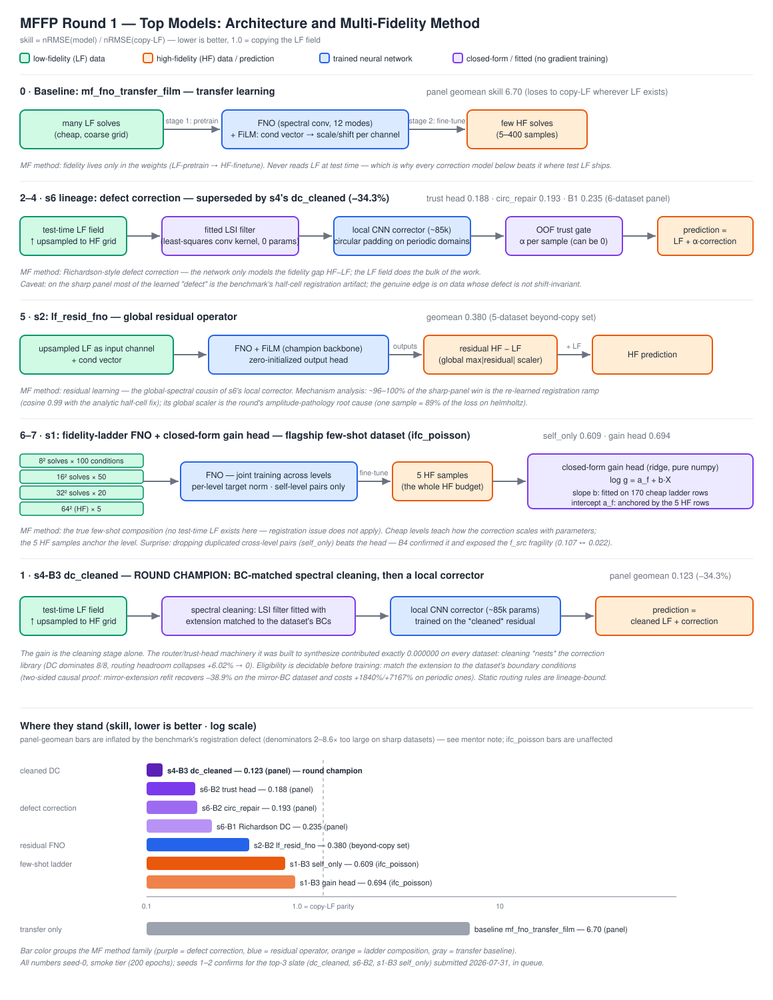
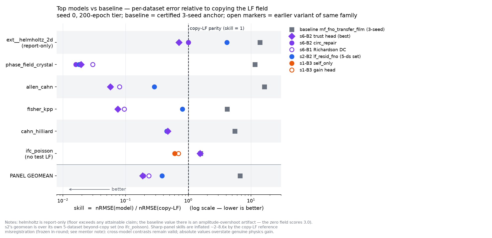

# MFFP Autoresearch Round 1 — Experiment Summary

> Generated by `tools/render_readme.py` — do not hand-edit. Last render: 2026-07-30 19:35 UTC.
> Full detail lives in each card JSON (`experiment_cards/{stream}/batch_N/BN.json`),
> the program spec (`program.md`), decision log (`state/orchestrator_flow.md`),
> and dashboard (`index.md`).





## Streams at a glance

| Stream | Current stage | Cards |
|---|---|---|
| `s1_poisson` | seed0_running (job 66076490; review PASS) | 4 |
| `s2_beyond_copy` | screen_running (review SUGGEST; HEAD-pin 71d4e7b verified; read screen_table+summary before promote) [inst:cb2f4ac5] | 3 |
| `s3_testtime` | retired_by_operator (ADR 0010) | 1 |
| `s3_warp` | seed0_running (job 66075124; review SUGGEST) | 2 |
| `s4_hybrid_routing` | starter_running (ROUTER card; report verified md5 39d4181d, snapshot report_verified_cb2f4ac5.md) [inst:cb2f4ac5] | 3 |
| `s5_tuning` | seed0_running (promoted A1_revin_lf; identity flag adjudicated as cuDNN nondeterminism) [inst:cb2f4ac5] | 3 |
| `s6_local` | B2_complete_holding (evidence absorbed into s4-B3 ROUTER; revisit after ROUTER lands) | 2 |
| `s7_loss` | CLOSED (B2 register complete 2026-07-30; all levers falsified or retrieval-refuted) | 2 |

## s1_poisson

### s1_poisson-B1 — COMPLETE

- **Type**: model   **Category**: mf_composition / ladder-data-fusion
- **Hypothesis / motivation**: The batch-1 seed direction (§12.1: "all-pairs fidelity training … `mf_field/akash/models/mf_fno_allpairs`") is scored by the websearcher as **`preempted-but-MF-composition-open`**, open only as "**Not found published**: (i) **all ordered pairs** (not just adjacent) as a data-amplification augmentation, (ii) with a **single shared** network rather than one net per level, (iii) …
- **Design**: family `mf_fno_ladder` in the worktree, vendored from `akash/models/mf_fno_allpairs` + `akash/common/backbone.py` (SMOKE hyperparameters identical to the anchor family: hidden 64, blocks 4, modes_cap 12, batch 16, lr_pretrain 1e-3, lr_finetune 3e-4, wd 1e-5, clip 1.0). Rows `(cond = [X, f_src, f_tgt]) → Y@(64,64)`, with `f = (log fid − log 8)/(log 64 − log 8)`. **Correction**:…
- **Expected**: metric = `ifc_poisson` test nRMSE → skill vs paper bar 0.036 (ADR 0002), mean over seeds {0,1,2}. Anchor = **1.5656 [1.4562, 1.6961]** (nRMSE ≈ 0.0564). Predictions: `allpairs` **skill 1.15–1.40 (nRMSE 0.041–0.050)**, point estimate ≈1.28 → Δ ≈ **−0.29 skill vs anchor**, just above the **0.2399** f…
- **Falsified if**: Falsified if the full-ladder all-ordered-pairs arm fails to beat the two-level arm on `ifc_poisson` by more than the certified noise floor — mean skill over seeds {0,1,2} improving by ≤ 0.240 skill units (≤ 0.00864 nRMSE) — which would mean the intermediate fidelities (16², 32²) carry no usable inf…
- **Prior art**: preempted-pivoted (6 citations)
- **Recipe**: base `mf_fno_allpairs` → `models_r1/mf_fno_ladder`, datasets ifc_poisson, 200 epochs, seeds [0, 1, 2]
- **Jobs**: 65991280 (seed0, 4 arms serial)
- **Result**: panel geomean skill 5.813198325385676 (arms: two_level 2.85, adjacent 6.06, allpairs 5.81, legacy_pairing 8.36); falsified
- **Mechanism**: {'protocol': 'Three probe turns, all in <worktree>/scratchpad, no SLURM, no worktree code edits, nothing recomputed by hand (every nRMSE via ${ROUND_ROOT}/eval/nrmse.py, every dataset read via ${ROUND_ROOT}/eval/panel_data.py). Turn 1 = data-level ladder diagnostic (reanalysis_turn_1.py -> turn1_out/turn1_results.json). Turn 2 = error de…
- **Next**: {'open_question': "Does the per-level target normalization survive at production capacity, and does the resulting full-ladder model beat anything that matters? Turn 3's proxy (hidden 16 / 2 blocks / modes 8, joint 30 ep, 1 CPU core) shows per-level normalization taking allpairs from 0.214313 to 0.0…

### s1_poisson-B2 — COMPLETE

- **Type**: model   **Category**: normalization × composition factorial / ladder-data-fusion
- **Hypothesis / motivation**: B1 measured a level-set effect *through* a normalization defect. The `mf_fno_ladder` family divides every pooled stage-1 target by ONE scalar taken from the coarsest, largest-amplitude level (`max|Y_all|` = 0.077146) while `ifc_poisson`'s four fidelity levels differ by a clean ~h² amplitude law spanning **75.7× in RMS** (consecutive ratios 4.3788 / 4.1957 / 4.1198). B1 part 6 …
- **Design**: Family `models_r1/mf_fno_ladder_norm`, vendored deterministically from B1's build commit (B2 gets a fresh worktree off `round1-substrate`, so B1's family must be re-materialized). Inside the B2 worktree: `git checkout d070f86f18028893c59618c291e5bf4ab5c37dba -- models_r1/mf_fno_ladder` then `git mv models_r1/mf_fno_ladder models_r1/mf_fno_ladder_norm`. Provenance pins to verif…
- **Expected**: Metric: `ifc_poisson` test nRMSE → skill vs paper bar 0.036 (ADR 0002), **seed 0 only**, labelled `provisional-single-seed` (ADR 0004). **Noise floor: 0.23990756 skill units = 0.0086367 nRMSE.** Four reference lines to carry in card part 4 (reason to carry them: McGreivy & Hakim 2024, https://arxiv…
- **Falsified if**: (TWO separate clauses — B1 part 7 requirement) - **F1 — normalization contrast.** Falsified if `allpairs__per_level` fails to beat `allpairs__shared` on `ifc_poisson` test nRMSE by more than the certified noise floor — seed-0 skill improving by ≤ **0.23991 skill units (≤ 0.0086367 nRMSE)** — which …
- **Prior art**: preempted-pivoted (11 citations)
- **Recipe**: base `mf_fno_ladder` → `models_r1/mf_fno_ladder_norm`, datasets ifc_poisson, 200 epochs, seeds [0]
- **Jobs**: 66008912 (seed 0, 5 arms serial: 2x2 factorial + shared_reweight), 66023672 (guard-set contract run, analyzer-flagged obligation)
- **Result**: panel geomean skill 0.9513894446867965 (arms: two_level__shared 2.85, allpairs__shared 5.82, two_level__per_level 2.18, allpairs__per_level 0.951, allpairs__shared_reweight 6.07); confirmed
- **Mechanism**: {'protocol': "Three probe turns, all in <worktree>/scratchpad, no SLURM, no worktree code edits, nothing recomputed by hand (every nRMSE via ${ROUND_ROOT}/eval/nrmse.py, nrmse_def_hash d3d0ade9191c13bacc40702f3eb26ad290e01641cacee22a1d2233b74c035850 = the card's hash; every dataset read via ${ROUND_ROOT}/eval/panel_data.py). This login n…
- **Next**: {'open_question': "Is ifc_poisson's gap CLOSED, or is 0.034250 a seed-0 point on a distribution whose mean straddles 0.036? Everything else about this stream now hinges on that one question, because the mechanism is settled and the remaining error is characterized. Specifically: (i) do seeds 1-2 of…

### s1_poisson-B3 — COMPLETE

- **Type**: model   **Category**: post-hoc per-sample gain calibration transferred across fidelity levels / MF composition on a frozen ladder operator
- **Hypothesis / motivation**: B2 settled the mechanism and characterised what is left: **57.10 %** of the winning arm's remaining squared error is a per-sample scalar gain that is **0.919-R^2 linear in the 5-D condition vector** and **cannot be fitted from the 5 HF training rows** (6 parameters, 5 points). The websearcher scores exactly this construction **`preempted-but-MF-composition-open`** and names th…
- **Design**: new family `models_r1/mf_fno_ladder_gain`, vendored from B2's build commit `21fdcda...` (`mf_fno_ladder_norm`, sha256-16 verified: backbone `f56fa8029fad2ffb`, model `740ed992efcda53e`, smoke_eval `2f9ffd46970040db`, manifest `91a853aabc96fe60`, INSPIRATION `4a2b3230005fb9d1`) and renamed. Three additive code changes: (1) `MFFP_GAIN_HEAD in {none, ladder_level_intercept, ladde…
- **Expected**: metric = `ifc_poisson` test nRMSE → skill vs paper bar 0.036 (ADR 0002), seed 0 only, `provisional-single-seed` (ADR 0004). Control 0.03425 / 0.9514 (B2 reproduction). **Primary predicted 0.0302 (0.0240–0.0343) = skill 0.839 (0.667–0.951)**, from the decomposition `nRMSE ~ sqrt(0.022917^2 + (1-R^2_…
- **Falsified if**: **F1 (primary)** — falsified if `gain__ladder_level_intercept` fails to beat `base__none` on `ifc_poisson` test nRMSE by more than the certified noise floor (seed-0 skill improving by <= 0.23990756 skill units = <= 0.0086367 nRMSE, i.e. not reaching <= 0.0256133 nRMSE / 0.711481 skill), which would…
- **Prior art**: preempted-but-MF-composition-open (8 citations)
- **Recipe**: base `mf_fno_ladder_norm` → `models_r1/mf_fno_ladder_gain`, datasets ifc_poisson, 200 epochs, seeds [0]
- **Jobs**: 66058189 (main seed-0 run via submit.sh — reviewer SUGGEST instruction 1), 66058194 (heat_local guard-contract leg on H100 — reviewer S1 closure, non-blocking plumbing)
- **Result**: panel geomean skill 0.6936117259676992 (arms: base__none 0.952, gain__ladder_level_intercept 0.694, gain__hf_only 0.951, gain__ladder_pooled 1.6, self_only__none 0.609); confirmed
- **Mechanism**: {'_scope': 'Mechanism analysis over 3 probe turns (scratchpad/reanalysis_turn_{1,2,3}{,_results}.{py,md} in the worktree). All CPU, artifacts + one CPU replay of the frozen base; no re-training, no GPU, no card-scored number recomputed by hand. Every nRMSE below is computed with ${EVAL_DIR}/nrmse.py under nrmse_def_hash d3d0ade9191c13bac…
- **Next**: {'open_question': "Is the `self_only` win a CONDITION-COVERAGE (effective-N) effect or an OPTIMIZATION-BUDGET effect? Turn 1 proved the two row sets contain the same 175 distinct (X, Y) rows and differ only in a per-level replication schedule (x1/x2/x3/x4), which simultaneously (a) shifts effective…

### s1_poisson-B4 — review PASS

- **Type**: model   **Category**: compute-vs-weighting attribution of the `self_only` win on the ifc fidelity ladder — a 2x2 controlled factorial (per-le…
- **Hypothesis / motivation**: B3 measured `self_only__none` at **0.021913 nRMSE / 0.6087 skill** — the round's best claimable `ifc_poisson` number — against the `allpairs` control's **0.034264 / 0.9518**, a gap of **0.3431 skill = 1.43x the certified floor**; and B3's mechanism turn 1 then proved the two row sets carry *identical* information (*"all six cross blocks are exact duplicates of the self block a…
- **Design**: new family `models_r1/mf_fno_ladder_attrib`, vendored from B3's build commit `57c24576abe6b045b837ccfd55f331a80e3f8b05` (`models_r1/mf_fno_ladder_gain`; §12 vendoring convention), head **OFF** everywhere (`MFFP_GAIN_HEAD=none`, `MFFP_GAIN_BASE_MUST_RESUME=0` — the `self_only__none` form), `MFFP_LADDER_SCALER=per_level` everywhere (under which row share *is* effective loss weig…
- **Expected**: All comparisons are in skill (nRMSE / paper_bar 0.036, ADR 0002; **lower is better**), `provisional-single-seed` (ADR 0004). Reference points: `state/noise_floor.json.ifc_poisson.min_claimable_effect` = **0.23990756 skill** (= 0.0086367 nRMSE); B3 measured A0-equivalent **0.6087** and A1-equivalent…
- **Falsified if**: the motivating "condition-space effective-N / level-weighting" hypothesis is falsified if the weight-only arm A4 (`so_rep_short`: `self_only` rows and steps, `allpairs` level weight shares) fails to degrade — i.e. lands at skill ≤ `skill(A0) + 0.23990756` — while the step-only arm A2 (`ap_rep_short…
- **Prior art**: preempted (9 citations)
- **Recipe**: base `mf_fno_ladder_gain` → `models_r1/mf_fno_ladder_attrib`, datasets ifc_poisson, 200 epochs, seeds [0]
- **Jobs**: 66076490 (main 6-arm factorial, seed 0, via submit.sh; review PASS)

## s2_beyond_copy

### s2_beyond_copy-B1 — COMPLETE

- **Type**: diagnostic   **Category**: diagnostic / copy-LF excess-error forensics
- **Hypothesis / motivation**: program.md §12.2 pre-directs batch 1 to be the diagnostic that "localize[s] where and how models lose to copy-LF". The websearcher's verdict for that direction (D1) is **`preempted-but-MF-composition-open`**: every metric is published and must be adopted by citation, while the *reference* (error relative to the model's own LF input) and the *setting* (sharp-2D multi-fidelity p…
- **Design**: new contract family `models_r1/s2_copylf_forensics/` (manifest.json + smoke_eval.py + INSPIRATION.md), run by `eval/score_panel.py` at `--epochs 0 --seed 0` over the five beyond-copy datasets. It trains nothing; it reloads the **batch-0 200-epoch checkpoints** at `round1/eval/results/<family>/ckpt_<ds>_e200_s{0,1,2}/last.pt` for `mf_fno_transfer_film` (ADR 0008: mf_fno_pinn_tr…
- **Expected**: nothing moves — a diagnostic measures. Predicted, and calibrated against hand-probes recorded in `iteration_1.md` (train-split, leave-one-out, no models; explicitly **not reportable** under §2.1): **M1** `lf_at_inference = false` for both certified families on all 5 datasets × 3 seeds — the champio…
- **Falsified if**: H1 ("the copy-LF gap is a conditioning-sufficiency dichotomy, not one localized model defect") is falsified if `|skill(best training-free X-only predictor) − skill(certified best family)| > 2.0` skill units on `sharp__allen_cahn_2d` (floor 1.6334) or `> 1.0` on `sharp__fisher_kpp_2d` (floor 0.4177)…
- **Prior art**: preempted-but-MF-composition-open (6 citations)
- **Recipe**: base `mf_fno_transfer_film` → `models_r1/s2_copylf_forensics`, datasets ext__helmholtz_2d,sharp__phase_field_crystal_2d,sharp__allen_cahn_2d,sharp__fisher_kpp_2d,sharp__cahn_hilliard, 0 epochs, seeds [0]
- **Jobs**: 65991328 (diagnostic single run, ROUND1_EVAL_RESULTS redirected per review S1)
- **Result**: panel geomean skill 9.6240222904; falsified
- **Mechanism**: {'_provenance': "3 probe turns; every number traces to worktrees/s2_beyond_copy/B1/scratchpad/reanalysis_turn_{1,2,3}_results.{md,json}. Probes are read-only re-analyses of the batch-0 checkpoints + panel data through round1/eval/{nrmse,panel_data}.py and the B1 family's own forensics kernels; no retraining, no SLURM.", 'findings': ['F1 …
- **Next**: {'open_question': "Does a family that takes the per-sample interpolated LF field as a NETWORK INPUT and predicts hf-lf actually clear the copy-LF bar on the Class-A datasets (pfc, cahn_hilliard, helmholtz)? A zero-parameter LF-keyed nearest-neighbour rule already reaches skill 0.562 / 0.625 / 0.785…
- **Operator amendment** (2026-07-29T17:05Z): S2B1_BASE_FAMILIES narrowed to mf_fno_transfer_film only; pinn checkpoint measurements dropped from 3_description. All other locked fields untouched.

### s2_beyond_copy-B2 — COMPLETE

- **Type**: model   **Category**: mf_composition / literature-standard LF-residual control vs a training-free retrieval floor (benchmark-floor discipline)
- **Hypothesis / motivation**: batch 1 established (F14, and the runtime M1 audit) that **0 of 27 factory families read the test split's LF field at inference**, and that a ZERO-PARAMETER rule (`copy-LF + mean of the 5 nearest train residuals`, keyed on a 16x16 block-mean signature of the test LF field) reaches panel geomean skill **0.7886** against the certified champion's **9.6362** (B1 part 6, F6). The b…
- **Design**: new family `models_r1/s2_lf_residual_control/` (manifest.json + smoke_eval.py + model.py + retrieval.py + INSPIRATION.md), substrate copied from `mf_fno_transfer_film` (`hidden_channels=64, n_blocks=4, modes_cap=12, batch_size=16, lr_pretrain=1e-3, lr_finetune=3e-4, weight_decay=1e-5, grad_clip=1.0, WORK_CAP=256`; s5-B1's relocated-import fix `REPO_ROOT = HERE.parents[1] / "mf…
- **Expected**: promoted-arm skill ~**0.40** pfc, ~**0.55** cahn_hilliard, ~**0.8** helmholtz (report-only), ~**1.02** allen_cahn, ~**1.03** fisher_kpp -> panel geomean **~0.713** (computed from those five), vs the training-free floor **0.7886** (B1 F6) and the certified champion **9.6362**; skill < 1 on >= 2 (tar…
- **Falsified if**: H-B2 ("a trained operator that receives the real coarse solve as an input and predicts the fidelity residual exploits the LF field at least as well as the training-free LF-keyed retrieval rule, and correctly no-ops where the residual is unlearnable") is FALSIFIED if, at 200 epochs / seed 0, the pro…
- **Prior art**: preempted (9 citations)
- **Recipe**: base `mf_fno_transfer_film` → `models_r1/s2_lf_residual_control`, datasets ext__helmholtz_2d,sharp__phase_field_crystal_2d,sharp__allen_cahn_2d,sharp__fisher_kpp_2d,sharp__cahn_hilliard, 200 epochs, seeds [0]
- **Jobs**: 66011965 (ADR-0007 screen: 4 trained arms + floors), 66023543 (200-ep seed 0, promoted lf_resid_fno = pinned rank 1; all arms survived; reviewer F1 guard applied)
- **Result**: panel geomean skill 0.38026407576440685; confirmed
- **Mechanism**: {'turn_files': ['worktrees/s2_beyond_copy/B2/scratchpad/reanalysis_turn_1_results.md', 'worktrees/s2_beyond_copy/B2/scratchpad/reanalysis_turn_2_results.md', 'worktrees/s2_beyond_copy/B2/scratchpad/reanalysis_turn_3_results.md'], 'findings': ["F1 (turn 1, tools/registration_audit.py + scratchpad/t1_decomposition.json). Every one of this …
- **Next**: {'open_question': "Is there ANY dataset on this panel where an LF-consuming operator beats a node-aligned (variant C/D/E) reference -- i.e. where a trained model extracts fidelity information the resampling convention does not already contain? B2 says no on all five of its datasets (model/best-free…

### s2_beyond_copy-B3 — review PASS-with-suggestions

- **Type**: model   **Category**: mf_composition / target-normalisation repair — per-sample amplitude normalisation of the fidelity residual with a test-…
- **Hypothesis / motivation**: B2 part 6 F10 located the root cause shared by this substrate's best and worst dataset: the family normalises its regression target by **ONE global `max|HF-LF_up|`** over the train split, while the per-sample residual scale spans decades — `max/median ||HF-LF_up||` = **82379** (pfc), **13702** (helmholtz), 3.91 / 3.97 / 2.08 (allen_cahn / cahn_hilliard / fisher_kpp); on helmho…
- **Design**: New family `models_r1/s2_resid_amplitude_norm`, **vendored verbatim** from `round1/worktrees/s2_beyond_copy/B2/models_r1/s2_lf_residual_control` at B2's build_commit `5bf0e86c292042b3050979f5c35af538305f1152` (which itself vendors `mf_fno_transfer_film` @ `967562e2a4e3493515edab36b0fcb23655fce71f`), then renamed. **Unchanged**: FNO2d network, `hidden_channels=64`, `n_blocks=4`…
- **Expected**: Seed 0, 200 epochs, `provisional-single-seed` (ADR 0004); all deltas against the **paired A0 control** in the same job, with B2's part-5 numbers as the cross-check (A0 must reproduce them within 10 % on pfc — F6's replay caveat — and 2 % elsewhere; a miss is recorded as a rebuild-fidelity flag, not…
- **Falsified if**: H-B3 ("the family's single global `max|HF-LF|` target scaler — not its architecture — is what breaks the LF-residual corrector on the two datasets whose per-sample residual scale spans decades, and replacing it by a per-sample amplitude normalisation whose test-time scale is PREDICTED from `(X, LF)…
- **Prior art**: preempted-but-MF-composition-open (8 citations)
- **Recipe**: base `s2_lf_residual_control` → `models_r1/s2_resid_amplitude_norm`, datasets ext__helmholtz_2d,sharp__phase_field_crystal_2d,sharp__allen_cahn_2d,sharp__fisher_kpp_2d,sharp__cahn_hilliard, 200 epochs, seeds [0]
- **Jobs**: 66076828 (ADR-0007 screen, 6 arms; review SUGGEST vs 71d4e7b; note-12 figures unverified pending 200-ep)

## s3_testtime

### s3_testtime-B1 — retired by operator

- **Type**: diagnostic   **Category**: residual-lever-feasibility-diagnostic
- **Hypothesis / motivation**: The websearcher's D1 row reads **"preempted-but-MF-composition-open (cite)"**, and the open seam it names is *"**field-space** vs weight-space optimization; doing it **from an MF prediction at N_hf = 5**; and scoring against **copy-LF** rather than against the base model — nobody in this literature uses that bar"*, under the fetched **standing threat** that residual minimizati…
- **Design**: family `models_r1/hh_residual_anatomy`, `epochs 0`. It rebuilds the certified champion from the three frozen batch-0 checkpoints (`eval/results/mf_fno_transfer_film/ckpt_ext__helmholtz_2d_e200_s{0,1,2}/last.pt`; `FNO2d(cond_dim=3, hidden=64, n_blocks=4, modes=(12,12), grid=(96,96))`, `scaler_hf` recomputed exactly as the champion's `smoke_eval.py` does) and measures on the 100…
- **Expected**: the hypothesis **holds**. Scored metric: `ext__helmholtz_2d` skill 13.817 → **3.035** (all three seeds land exactly on the zero field; the 9.695 seed spread collapses to ~0 **by annihilation**, not by stabilisation). That is a 10.78-skill-unit move, which clears the 9.695 noise floor yet is *degene…
- **Falsified if**: Falsified if some exact-residual test-time configuration whose output is initialisation-dependent (base-init vs zero-init outputs differing by ≥ 10% relative L2, i.e. demonstrably not a re-solve) reduces the certified champion's `ext__helmholtz_2d` mean skill from 13.817 to below **3.035** — the tr…
- **Prior art**: preempted-but-MF-composition-open (cite) (4 citations)
- **Recipe**: base `mf_fno_transfer_film` → `models_r1/hh_residual_anatomy`, datasets ext__helmholtz_2d, 0 epochs, seeds [0]
- **Operator amendment** (2026-07-29T18:00Z): Stream retired before SLURM submission; builder stopped mid-build. Card preserved for audit. Not a skip/abandonment.

## s3_warp

### s3_warp-B1 — COMPLETE

- **Type**: diagnostic   **Category**: diagnostic / warp-opportunity oracle — displacement-vs-thickness decomposition of the LF->HF discrepancy on the beyond-…
- **Hypothesis / motivation**: The websearcher's prior-art verdict makes D2 both the least preempted direction and the gate on D1. Verbatim, the D2 row's open part: *"The metric is old; no fetched source applies it **between two fidelities of one PDE solve**, and none reports an oracle-warp upper bound on MF fusion error. It also gates D1: iteration 4's two-regime finding (shape/position vs interfacial-thic…
- **Design**: new contract family `worktrees/s3_warp/B1/models_r1/s3_warp_oracle/` (`manifest.json` with `"diagnostic": true`, `smoke_eval.py` on the unchanged six-argument factory CLI, `INSPIRATION.md`, helper modules), invoked by unmodified `eval/score_panel.py` at `--epochs 0 --seed 0` on the five beyond-copy datasets. It trains no model. The warp primitive is `torch.nn.functional.grid_s…
- **Expected**: The measured quantity is `skill_oracle(C=16) = nRMSE(oracle-warped LF) / nRMSE(copy-LF)` per dataset; copy-LF is skill 1.0 by definition, so an effect is `1 - skill_oracle`. Predictions, grounded in the s2 copy-LF geometry: - `sharp__allen_cahn_2d` — copy-LF error most interface-concentrated (2.049…
- **Falsified if**: **Leg A (primary)** — the stream premise ("the LF->HF discrepancy on sharp-interface panel datasets is substantially a geometric displacement of features") is **falsified** if the oracle warp at the learnable rung (`C = 16`, smoothness-penalised, `|phi| <= 16` cells) leaves `skill_oracle > 0.44` (i…
- **Prior art**: preempted-pivoted (4 citations)
- **Recipe**: base `none (new diagnostic family; no base model, no checkpoint reload, nothing trains)` → `models_r1/s3_warp_oracle`, datasets ext__helmholtz_2d,sharp__phase_field_crystal_2d,sharp__allen_cahn_2d,sharp__fisher_kpp_2d,sharp__cahn_hilliard, 0 epochs, seeds [0]
- **Jobs**: 66001846 (diagnostic single run), 66011595 (debug attempt 1 relaunch, seed 0)
- **Result**: panel geomean skill 0.42809799641105367; confirmed
- **Mechanism**: {'findings': ["F1 (turn 1) THE CAUSE OF A1 IS A GRID-REGISTRATION CONVENTION, MEASURED IN CLOSED FORM. eval/panel_data.py::copylf_prediction upsamples with scipy.ndimage.zoom(order=1, grid_mode=True, mode='nearest'), i.e. the CELL-CENTRED convention: pushing a linear index ramp through the real function shows it samples LF index (k+0.5)/…
- **Next**: {'open_question': 'On sharp__cahn_hilliard -- the ONE panel dataset whose beyond-copy gap survives registration correction (residual oracle-warp ceiling 83-85 % over a correctly registered copy-LF, residual median |phi| 0.64-0.74 HF cells, and refractory to a linear filter at skill 0.44) -- is that…
- **Operator amendment** (2026-07-29T19:55Z): Part-3 M9 self-test threshold 'warped error < 5% of unwarped' is provably unsatisfiable: the card's own pseudo-LF construction (warp(HF,d)) imposes a double-bilinear-resample floor — the EXACT planted displacement reach…

### s3_warp-B2 — review PASS-with-suggestions

- **Type**: model   **Category**: mf_composition / one-sided warp-then-correct on the corrected LF->HF path -- displacement-vs-intensity attribution on s…
- **Hypothesis / motivation**: B1 part 7's gate question -- *"is that displacement field PREDICTABLE from the LF field a model actually receives, or is it only visible to an HF-fitted oracle?"* -- is exactly the slice the batch-2 websearch found open. Verdict (i), verbatim: *"preempted-but-MF-composition-open ... The **one-sided** instance: displacement predicted from the LF PDE field + condition vector wit…
- **Design**: new contract family `models_r1/s3_warp_onesided` (CLI unchanged), one invocation of the unmodified `eval/score_panel.py --datasets sharp__cahn_hilliard --epochs 200 --seed 0`. - **Shared input path (JUBW-compliant, ONE interpolation)**: raw LF `field_by_fid[2]` (128^2) sampled once at node-aligned HF coordinates `k/2 + phi_k/2` (HF `fid 3`, 256^2, r=2, 400 train / 100 test, `c…
- **Expected**: scored metric = `nRMSE` on `sharp__cahn_hilliard` `test_hf`, reported as skill vs the frozen copy-LF reference 0.08765999100758841 (skill 1.0). | key | predicted skill | grounding | |---|---|---| | `ref_frozen_copylf` | 1.000 exactly | seam S1 | | `ref_reg_corrected` | 0.477 +- 0.01 | B1 F3 variant…
- **Falsified if**: the one-sided displacement head is falsified as a mechanism if it fails to beat the best of `{ref_warp_off, ref_const_disp, ref_lsi}` by more than 0.20 skill units on `sharp__cahn_hilliard` (equivalently captures <= 51 % of B1's certified 83.4-85.2 % oracle ceiling) with seams S1-S5 passed -- in wh…
- **Prior art**: (i) *"preempted-but-MF-composition-open"* -- citations `Flowers https://arxiv.org/html/2603.04430`, `MetaRegNet https://arxiv.org/pdf/2303.09088`, `Khamlich https://arxiv.org/html/2603.04232v2`, `Fourier-Net https://arxiv.org/abs/2211.16342`, `SuperWarp https://pmc.ncbi.nlm.nih.gov/articles/PMC9645132/`, `M2N https://arxiv.org/abs/2204.11188`, `UM2N https://arxiv.org/abs/2407.00382`, `weather-SR flow matching https://arxiv.org/html/2604.00897`; open part verbatim: *"The **one-sided** instance: displacement predicted from the LF PDE field + condition vector with **no target field at inference**, applied to that field before a learned correction, inside an MF operator surrogate at small N_hf. Registration is pairwise; mesh-movement nets output nodes not fields; MF/SR fusion is value-space. Every *component* (band-limited Fourier displacement head, supervised warp targets, single-interpolation warp) is published -- the claim is composition + measurement, on ONE dataset (floor 0.553)."* (ii) *"preempted (cite)"* -- `JUBW: Makansi/Ilg/Brox https://arxiv.org/abs/1707.00471`, open part verbatim: *"**Nothing.** The 2017 motivation is verbatim B1 F17 ... It is an implementation obligation to cite, never a contribution."* (iii) *"preempted-but-MF-composition-open (weak novelty, strong measurement value)"* -- `MI2A https://arxiv.org/abs/2504.11433`, open part verbatim: *"**No fetched source, in any field, reports a quantitative per-term attribution of a displacement-vs-intensity error split** -- and none does it across two fidelities of one PDE solve. Joint-vs-sequential cannot be settled by citation (ablations point both ways) -> must be a control arm."* Also cited for the GT-free diagnostic: `inverse-consistency error https://pmc.ncbi.nlm.nih.gov/articles/PMC3915046/`. (11 citations)
- **Recipe**: base `none as a trained base (new family, built from scratch). TWO modules VENDORED VERBATIM with provenance headers: (a) worktrees/s3_warp/B1/models_r1/s3_warp_oracle/warp_core.py from branch round1/exp-s3_warp-B1 @ 4799abdec705d64e8300b18ab0650fb74e012c9b -> models_r1/s3_warp_onesided/warp_core.py (oracle-phi fitter, unmodified, seam S3); (b) fit_transfer/apply_transfer/rho from mffp_autoresearch/round1/tools/defect_correction_learnability.py -> models_r1/s3_warp_onesided/lsi_ref.py (s6_local-B1's LSI definition, unmodified, seam S4). No checkpoint is reloaded from any prior model.` → `models_r1/s3_warp_onesided`, datasets sharp__cahn_hilliard, 200 epochs, seeds [0]
- **Jobs**: 66075079 (main seed-0 run via submit.sh; review SUGGEST; step-A seam gate enforced in-job), 66075124 (DUPLICATE of 66075079 — orchestrator submitted unaware the job was already up; scancel'd at 0:25 elapsed; no artifacts written)

## s4_hybrid_routing

### s4_hybrid_routing-B1 — COMPLETE

- **Type**: model   **Category**: mf_composition_measurement
- **Hypothesis / motivation**: Panel-benchmark the built-but-unbenchmarked `mf_field/akash/models/fno_transolver_seq` (FNO-FiLM base + zero-init, alpha-gated Transolver corrector trained on out-of-fold LF→HF residuals), reading the **per-dataset gate `alpha`** as the measurement. The websearcher's prior-art verdict for this direction (D1) is `preempted-but-MF-composition-open`, and its instruction is verbat…
- **Design**: 1. `models_r1/fno_transolver_seq/` = verbatim copy of the three files from `mf_field/akash/models/fno_transolver_seq/` at `967562e` (`git diff --stat round1-substrate -- <those paths>` is empty). 2. Exactly **two** mechanical edits (a third should draw a code-reviewer FAIL — the artifact under measurement must stay the built family): (a) replace `AKASH = Path(__file__).resolve…
- **Expected**: - *Free sanity gate*: `base_only_rel_l2` reproduces the batch-0 anchor per-dataset skills within each dataset's `min_claimable_effect` (the stage-1 recipe is the byte-identical `SMOKE` dict + `WORK_CAP = 256`); a larger gap means broken plumbing, not science. - *Primary*: `alpha > 0` on **≥ 3 of th…
- **Falsified if**: If the fitted gate `alpha` is 0 on ≥ 4 of the 5 sharp-2-D panel datasets at seed 0 (the least-squares + line-search-containing-0 gate rejecting the correction on its own held-out split) **and** no sharp-2-D dataset's 3-seed mean skill beats the batch-0 anchor by at least its `min_claimable_effect` …
- **Prior art**: preempted-but-MF-composition-open (2 citations)
- **Recipe**: base `fno_transolver_seq` → `models_r1/fno_transolver_seq`, datasets panel, 200 epochs, seeds [0, 1, 2]
- **Jobs**: 65996887 (helmholtz), 65996889 (pfc), 65996893 (allen_cahn), 65996895 (fisher_kpp), 65996897 (cahn_hilliard), 65996898 (ifc_poisson), 65996899 (guard), 65996900 (panel aggregate, afterok)
- **Result**: panel geomean skill 5.664888697217776; confirmed
- **Mechanism**: {'_provenance': "3 probe turns; every number traces to worktrees/s4_hybrid_routing/B1/scratchpad/reanalysis_turn_{1,2,3}_results.md and the JSONs they cite (gate_replay_<ds>.json, anatomy_<ds>.json, ctxcf_<ds>.json, routing_<ds>.json). All probes are read-only replays of the shipped seed-0 checkpoints under round1/eval/results/fno_transo…
- **Next**: {'open_question': "Does the alpha-gated correction mechanism have ANY headroom left once the gate is scored on a base-out-of-sample split, or is its ceiling structurally skill 1.0? Turn 2 shows the correction is collinear with `copylf - base` (cosine 0.54-0.83) and orthogonal to the fidelity gap `h…

### s4_hybrid_routing-B2 — COMPLETE

- **Type**: model   **Category**: mf_composition_repair_and_class_test
- **Hypothesis / motivation**: the batch-2 verdict leaves s4 exactly one `novel` surface and two `preempted` repairs it must run as measurements. Quoted verbatim from `websearches/s4_hybrid_routing/batch_2/report.md`: *"Nobody has run it: matched-parameter cross-attention corrector vs local/LSI corrector on the same `hf - base` (or `hf - copylf`) target, on regular grids with sharp interfaces, at N_hf ≈ ten…
- **Design**: vendor `models_r1/fno_transolver_seq` @ `4691d1f...` (B1's build commit, sha256-verified per file) to `models_r1/fno_transolver_seq_b2`; `model.py` byte-identical; all new behaviour env-gated and defaulting to B1 semantics. Four edits: (1) `_fit_alpha` gains a scoring base — `S4_GATE_BASE=oof` scores the 0-containing **shrinkage line search** against `base_oof[val_idx]` (alrea…
- **Expected**: (all `provisional-single-seed`, ADR 0004; floor convention: absolute `min_claimable_effect` where the arm sits at the anchor's scale, relative 10% where the absolute floor exceeds the arm's whole skill — justified by the certified 3-seed *relative* spreads fisher_kpp 2.197%, cahn_hilliard 3.467%, p…
- **Falsified if**: If (C1) the base-out-of-sample gate fails to improve `sharp__cahn_hilliard` by more than 10% relative (0.48762844 -> <= 0.43886560, i.e. >= 0.5562725 skill units, above the certified floor 0.5533466) against the paired in-sample-gate leg of the same run, AND (C2) the dense-LF arm fails to beat the …
- **Prior art**: preempted (cite) [arm A gate repair] / preempted-but-MF-composition-open (cite) [arm B dense context] / novel [arm C head-to-head] (11 citations)
- **Recipe**: base `fno_transolver_seq` → `models_r1/fno_transolver_seq_b2`, datasets panel, 200 epochs, seeds [0]
- **Jobs**: 66022845 66022846 66022847 66022848 66022846 66022849 66022846 66022850 (screen -> afterok 13-task array -> afterok per-arm aggregates; screen time overridden to 02:00:00 per review S1), 66023665 66023666 66023667 66023668 66023669 66023670 (debug attempt 1 relaunch of the full chain: screen 2 h -> afterok 13-task array -> afterok per-arm aggregates, plus the two afterok guards; the 02:00:00 screen override per review S1 is APPLIED this time, verified via squeue TIME_LIMIT -- on the first launch submit.sh silently dropped it and the screen ran with 01:00:00)
- **Result**: panel geomean skill 5.41018329550836 (arms: gate_repair 5.41, gate_repair_dense 3.74, attn_gap_fkpp {'per_seed': [None], 'mean': None, 'ci9…); confirmed
- **Mechanism**: {'findings': ['F1 (turn 1) Stage 3 is kept on 5 of 12 arm x dataset cells -- gate_repair/{pfc, cahn_hilliard} and gate_repair_dense/{pfc, fisher_kpp, cahn_hilliard} -- and on ALL FIVE its held-out keep test is sign-inverted against the truth: it claims +69.43/+63.76/+84.75/+14.21/+75.97 % val gain while the test split delivers -20.43/-25…
- **Next**: {'open_question': "Is ANY component of this stream's hybrid moving along `hf - copylf`, or is the whole family confined to the span of `copylf - base` (whose optimum is copy-LF, skill 1.0)? Every measurement on this card points at confinement: the dense corrector's cos with `hf - copylf` is 0.028 /…

### s4_hybrid_routing-B3 — drafted (pre-build)

- **Type**: model   **Category**: mf_composition_router_superlearner_lsi_cleaned_target
- **Hypothesis / motivation**: The round's synthesis slot takes the ONE form the prior-art verdict leaves open and claims nothing else. On the router itself the verdict is explicit — **D1: `preempted-but-MF-composition-open (cite)`** — *"The **selection rule is not open** (discrete super learner) and **availability-keyed gating is not open** (missing-modality MoE). Open: no fetched source routes on **fideli…
- **Design**: A single family `models_r1/s4_router`, vendored from `models_r1/s6_local_repair` @ `d083d44` (s6_local-B2), implementing **two nested discrete super learners** plus one target change, run as a **6-arm sweep with a fixed promotion rank**. 1. **L0 — availability gate (zero training, a data property).** `test["lf_fids"]` empty → champion transfer branch (`ifc_poisson` only, the s…
- **Expected**: | quantity | predicted | comparator | floor | resolvable? | |---|---|---|---|---| | panel geomean skill, `router` | **0.150 – 0.190** | anchor 6.703016 (`state/anchors/s4_hybrid_routing.json`) | 13.183 % | trivially (≈ −97 %) — REPORTED, **no clause** | | panel geomean, `router` vs `lsi_ctrl` (≈ 0.…
- **Falsified if**: **PRIMARY (no-harm)** — the card is falsified if `router`'s test nRMSE exceeds the lower of its own two in-batch branches (`min(lsi_ctrl, corr_cleaned)` on the five LF-bearing panel datasets; `champion_ctrl` on `ifc_poisson`) by more than that dataset's certified relative floor (10.000 % on pfc / a…
- **Prior art**: preempted-pivoted (11 citations)
- **Recipe**: base `s6_local_repair` → `models_r1/s4_router`, datasets panel, 200 epochs, seeds [0]
- **Operator amendment** (2026-07-30T23:10Z): Resolve the starter-flagged TBD (honesty label on the 1-rho_LSI >= 0.15 routing rule) by inserting the brainstormer's own return text verbatim; provenance = the brainstormer agent's final return message of 2026-07-30 (i…

## s5_tuning

### s5_tuning-B1 — COMPLETE

- **Type**: model   **Category**: tuning_spectral_bandwidth
- **Hypothesis / motivation**: F22 (`modes_cap = 12` never scales with resolution — 12 of 128 modes at 256²) with candidate M1's proposed 32, measured on the certified champion `mf_fno_transfer_film`. This is the card program.md §12.5 pre-directs (*"G4's dry-run card (`s5_tuning-B1`, modes_cap 12→32 on the champion) is a REAL batch-1 card for this stream."*) and the one `state/gates.md` G4 is PENDING on. Th…
- **Design**: 1. Copy `mf_field/factory_mffp/models/mf_fno_transfer_film/` (substrate commit `967562e`, tree `5f62eaa`) into `<worktree>/models_r1/mf_fno_transfer_film_modes/`; rename in `manifest.json` and in the `finalize_and_write(model=...)` string. 2. Fix the relocated import root: `REPO_ROOT = HERE.parents[1] / "mf_field" / "factory_mffp"` (the current `HERE.parent.parent` at smoke_ev…
- **Expected**: metric = 3-seed mean panel geomean skill vs the certified anchor **6.703** [6.219, 7.102] (`state/anchors/s5_tuning.json`), with the mandatory per-dataset skill table. | dataset | anchor skill | noise floor | predicted at cap 32 | |---|---|---|---| | `sharp__allen_cahn_2d` | 16.334 | 1.633 | 15.0–1…
- **Falsified if**: If the cap-32 arm's 3-seed mean panel geomean skill is not at least 0.884 skill units below the certified anchor 6.703 (i.e. not <= 5.819) AND no stable panel dataset improves by more than its own `min_claimable_effect` (`sharp__phase_field_crystal_2d` 1.151, `sharp__allen_cahn_2d` 1.633, `sharp__f…
- **Prior art**: preempted-pivoted (7 citations)
- **Recipe**: base `mf_fno_transfer_film` → `models_r1/mf_fno_transfer_film_modes`, datasets panel, 200 epochs, seeds [0, 1, 2]
- **Jobs**: 65988184 (seed0, RUNNING), 65988185 (guard_contract, COMPLETED), 65988186 (recert, FAILED: bad venv path — orchestrator infra, not card), 65989097 (recert resubmit)
- **Result**: panel geomean skill 6.195848329238065; not_resolvable
- **Mechanism**: {'probe_protocol': "3 probe turns, seed 0, no retraining. All comparisons are PAIRED against the ADR-0005 same-hardware cap-12 control (recert/training_h100/mf_fno_transfer_film), whose test predictions were regenerated by re-running THIS card's family entrypoint with MFFP_MODES_CAP=12 on the recert last.pt (eval-only branch). Seam-check…
- **Next**: {'open_question': "The champion's field prediction on 3 of the 4 sharp panel datasets is a DC (spatial-mean) level plus an uncorrelated noise pattern (demeaned corr 0.001-0.012, pattern-only nRMSE ~1.0). Is that because the condition vector genuinely does not determine the field at these sample cou…

### s5_tuning-B2 — COMPLETE

- **Type**: model   **Category**: tuning_target_scaler
- **Hypothesis / motivation**: measure the champion's OUTPUT-TARGET SCALER — the knob s5-B1 part 7 named ("*the leading candidate is the NORMALIZATION knob, not another capacity knob*") — claiming no novelty, with the verdict placed on the datasets whose noise floor permits one. The batch-2 prior-art verdict licenses exactly this: row (ii) `preempted` — "*Nothing novel — defensible ONLY as a measurement. Op…
- **Design**: worktree family `models_r1/mf_fno_transfer_film_scaler` = a copy of `mf_field/factory_mffp/models/mf_fno_transfer_film` at `967562e`, with s5-B1's three plumbing deltas (REPO_ROOT fix, knob provenance in result-JSON `extra`, periodic `last.pt` + config-match resume gate) and ONE behavioural change: the target-scaler block (base `smoke_eval.py:210-211`, and the denormalization …
- **Expected**: (arm A2, seed 0, provisional-single-seed, PRIMARY basis): `sharp__fisher_kpp_2d` improves by **>= 0.418** skill (4.177 -> <= 3.759; pooled `|mean|/sd` = 3.75, `max/sd` = 6.00 — the largest affine change on the panel); `ifc_poisson` improves by **>= 0.240** (1.566 -> <= 1.326; `|mean|/sd` = 1.43 and…
- **Falsified if**: if the promoted arm's seed-0 200-epoch panel run moves NO non-helmholtz panel dataset beyond its own `min_claimable_effect` in either direction (`ifc_poisson` 0.240, `sharp__fisher_kpp_2d` 0.418, `sharp__cahn_hilliard` 0.553, `sharp__phase_field_crystal_2d` 1.151, `sharp__allen_cahn_2d` 1.633) AND …
- **Prior art**: preempted (9 citations)
- **Recipe**: base `mf_fno_transfer_film` → `models_r1/mf_fno_transfer_film_scaler`, datasets panel, 200 epochs, seeds [0]
- **Jobs**: 66012553 (ADR-0007 screen: 5 scaler arms + helmholtz default-equivalence), 66024808 (ADR-0007 screen re-run after debug attempt 1: --no_cache + CPU equivalence instrument), 66023686 (debug attempt 1 verification: GPU/CPU determinism matrix), 66056499 (main 200-epoch seed-0 run, promoted arm A2 zscore)
- **Result**: panel geomean skill 5.554667947197018; confirmed
- **Mechanism**: {'provenance': "three mechanism turns, all CPU/numpy, no re-training and no GPU: worktrees/s5_tuning/B2/scratchpad/reanalysis_turn_{1,2,3,3b}.py -> turn1_helmholtz_recovery.json, turn2_predictor.json, turn3_mechanism.json, turn3b_displacement_alignment.json, turn3_predictor_scatter.png, with reanalysis_turn_{1,2,3}_results.md. Every pair…
- **Next**: {'open_question': "The scaler bought CALIBRATION, and calibration is exhausted: on ext__helmholtz_2d 91.6% of the gain was per-sample amplitude that an oracle rescale gives for free, and the arm is still 2.2x worse than the constant-field oracle there and 5.77x worse than copy-LF; on ifc_poisson th…

### s5_tuning-B3 — review PASS-with-suggestions

- **Type**: model   **Category**: tuning_persample_target_scaler
- **Hypothesis / motivation**: s5-B2 part 6 F1 falsified, arithmetically, the story the arm was designed around — helmholtz HF-stage effective N is **1.0145/400** under `maxabs` and **1.0179/400** under `zscore`, because *"a global scalar divides every sample's energy by the same constant"*. B2 part 7 names the only intervention that can move it (*"only a PER-SAMPLE scale can"*) and hands B3 the arm that wa…
- **Design**: New worktree family `models_r1/mf_fno_transfer_film_scaler_ps`, vendored from `worktrees/s5_tuning/B2/models_r1/mf_fno_transfer_film_scaler` @ `a55c788e...` (itself `mf_fno_transfer_film` @ `967562e2...`). Network, `F.mse_loss`, optimizer, schedule, batch size, epochs and `modes_cap=12` untouched. **Seven env-gated deltas, all defaulting to B2's exact behaviour:** | # | knob |…
- **Expected**: **Expected outcome** (seed 0, 200 ep, `provisional-single-seed`, PRIMARY basis = the paired in-job A0; SECONDARY = s5-B2 part-5 and s5-B1's H100 same-hardware maxabs control): | leg | metric | prediction | vs floor | |---|---|---|---| | **A4 oracle, ifc_poisson** (PRIMARY numeric) | `ref_oracle_per…
- **Falsified if**: **Expected falsification** (one sentence, then the legs): *H-s5B3 — "on the LF-blind champion lineage a per-sample output-target scale taken from the sample's own LF field repairs the effective N of the realized per-batch loss where the dataset is eligible (`G >= 8` AND a live pattern channel), and…
- **Prior art**: preempted-but-MF-composition-open (E1), oracle-only (E2), attribution-open (E3), application-open (E4a), predictor-under-test (E4b) (8 citations)
- **Recipe**: base `mf_fno_transfer_film_scaler` → `models_r1/mf_fno_transfer_film_scaler_ps`, datasets ext__helmholtz_2d,ifc_poisson,sharp__cahn_hilliard,sharp__fisher_kpp_2d, 200 epochs, seeds [0]
- **Jobs**: 66075574 (ADR-0007 screen: 6 arms + deferred helmholtz/fisher_kpp default-equivalence legs; review SUGGEST), 66075574 (ADR-0007 screen; submitted by inst-6f03a0f7... the other instance; read+adjudicated by inst-cb2f4ac5), 66076686 (main 200-ep run, promoted arm A1_revin_lf; screen read + identity flag adjudicated)

## s6_local

### s6_local-B1 — COMPLETE

- **Type**: model   **Category**: mf_composition / trust-gated LOCAL corrector on the real LF field
- **Hypothesis / motivation**: s2_beyond_copy-B1's M1 measured that the champion `mf_fno_transfer_film` is **LF-blind at inference** — `lf_at_inference = FALSE` on 5/5 datasets x 3/3 seeds, `n_field_shaped_inputs_at_eval = 0`, "the only tensor entering the network at eval is the `[16, cond_dim]` condition vector" (verified independently in `factory_mffp/models/mf_fno_transfer_film/model.py::FNO2d.forward`, …
- **Design**: New family `models_r1/s6_local_lf_corrector`, one substrate, five env-selected variants. Prediction on any dataset whose **test** split ships an LF fidelity (all five beyond-copy datasets and all three guard datasets — verified on disk): ``` LF_up = interp(field_by_fid[max(lf_fids)] -> 256-capped working grid) # == copy-LF construction Delta = C_theta(LF_up, coords, FiLM(X)) #…
- **Expected**: Panel geomean skill **~1.03** vs the certified anchor **6.703016** — `Delta ~ -5.67`, **6.4x the 0.884 geomean floor** (the s5-B1 convention, = the anchor ci95 width). Composition: the five beyond-copy datasets land in skill **[0.85, 1.00]** (they start at exactly 1.000 by construction and can only…
- **Falsified if**: H2-local is falsified if, at 200 epochs seed 0, EITHER the promoted variant's panel geomean skill is not at least 0.884 skill units below the certified anchor 6.703016 (i.e. not `<= 5.819016`) or any of `sharp__allen_cahn_2d`, `sharp__phase_field_crystal_2d`, `sharp__cahn_hilliard`, `sharp__fisher_…
- **Prior art**: preempted-but-MF-composition-open (13 citations)
- **Recipe**: base `mf_fno_transfer_film` → `models_r1/s6_local_lf_corrector`, datasets panel, 200 epochs, seeds [0]
- **Jobs**: 66001190 (no-harm screen, contract tier), 66001535 (200-epoch seed 0, promoted variant local_pixel_gate), 66005834 (200-ep guard set, analyzer-recommended pre-claim)
- **Result**: panel geomean skill 0.23457231117044963; confirmed
- **Mechanism**: {'_provenance': "3 probe turns, read-only re-analysis of the shipped 200-epoch seed-0 checkpoints (job 66001535) + panel data through round1/eval/{nrmse,panel_data}.py. No retraining, no SLURM, no worktree code edits. Every number traces to worktrees/s6_local/B1/scratchpad/{turn1_gate_<ds>.json, turn2_lsi_<ds>.json, turn3_defect_learnabi…
- **Next**: {'cross_stream_notes': "1) ROUND-WIDE METHOD NOTE: any card that claims a copy-LF win on a nested factor-2 ladder must report `tools/defect_correction_learnability.py --datasets PANEL`'s skill_LSI alongside its own number. On three of the five beyond-copy datasets a zero-parameter filter is better …

### s6_local-B2 — COMPLETE

- **Type**: model   **Category**: mf_composition / control-and-repair on the B1 defect-correction substrate — circular-padding repair + zero-parameter cl…
- **Hypothesis / motivation**: the batch has exactly one open surface and three preempted-but-owed controls, and B1's own part 7 demands this batch ("s6-B2 should be a CONTROL-AND-REPAIR card on the same family, not a new architecture, and it must carry the closed-form filter as a scored arm ... Do NOT spend a batch on capacity, depth, receptive field or modes"). The open surface is verdict row (iii): "A **…
- **Design**: family `models_r1/s6_local_repair`, vendored from `models_r1/s6_local_lf_corrector` @ `3abc0e3` with sha256-16 pins verified before any edit (`bands.py 42b869598fcc864e`, `local_corrector.py dcf531f8207b93a3`, `model.py 80d8940d8b90a4ac`, `smoke_eval.py 91ee5a6459609a26`, `manifest.json f336edbecb2de3c7`, `INSPIRATION.md ece1c608b492dbe1`). Five env-selected arms, one SLURM ch…
- **Expected**: (all `provisional-single-seed`, ADR 0004; anchor = B1's geomean 0.234572): | arm | pfc | allen_cahn | fisher_kpp | cahn_hilliard | helmholtz | ifc_poisson | panel geomean | |---|---|---|---|---|---|---|---| | `b1_replica` (V1 target) | 0.030017 | 0.080532 | 0.095132 | 0.468584 | 1.000000 | 1.545326…
- **Falsified if**: (one sentence per contrast; full text in iteration_1.md section 3): **C1** — the padding repair is falsified if `circ_repair`'s test nRMSE is not at least 10% below `b1_replica`'s on **both** pfc and allen_cahn (predicted -46.2% / -39.3%), which would mean the 45-81% boundary error share was not th…
- **Prior art**: preempted-but-MF-composition-open (cite) (16 citations)
- **Recipe**: base `s6_local_lf_corrector` → `models_r1/s6_local_repair`, datasets panel, 200 epochs, seeds [0]
- **Jobs**: 66014970 (2-epoch plumbing screen), 66024957 (2-epoch plumbing screen, relaunch after debug attempt 1), 66056503 (main sweep: 5 arms + 2 guard legs, seed 0, --time 02:00:00; after re-screen 66024957 all_pass)
- **Result**: panel geomean skill 0.19257491364521565 (arms: b1_replica 0.235, circ_repair 0.193, lsi_ctrl 0.197, pointwise_ctrl_circ 1.01, trust_head_circ 0.188); confirmed
- **Mechanism**: {'_provenance': "3 probe turns, read-only re-analysis of the shipped 200-epoch seed-0 checkpoints (job 66056503) through round1/eval/{nrmse,panel_data}.py. No retraining, no SLURM, no worktree code edits, no touch to part 5 or any locked field. Every number traces to worktrees/s6_local/B2/scratchpad/{reanalysis_turn_1_results.json, reana…
- **Next**: {'cross_stream_notes': "1) ROUTER (s4_hybrid_routing-B3) - THE THREE INGREDIENTS IT IS HOLDING FOR. (a) WHERE THE TRAINED CORRECTOR GENUINELY WINS is not 'non-periodic data' but 'data whose defect is not shift-invariant', and the eligibility statistic is free and training-free: `1 - rho_LSI(val)` f…

## s7_loss

### s7_loss-B1 — COMPLETE

- **Type**: model   **Category**: objective-reparameterization
- **Hypothesis / motivation**: the prior-art verdict row for **C-AMP** (`preempted-but-MF-composition-open`), verbatim: *"Open: amplitude/shape-decomposed objective for **multi-fidelity PDE field regression scored on unchanged per-sample rel-L2**. No fetched source applies gain-invariant training to neural PDE surrogates. Design constraint: full scale-invariance is unscoreable under rel-L2 — use a two-term …
- **Design**: new family `models_r1/mf_fno_transfer_film_s7loss/`, a verbatim copy of `mf_fno_transfer_film` (substrate `967562e`) with (a) the s5-B1 relocation fix `REPO_ROOT = HERE.parents[1] / "mf_field" / "factory_mffp"`, (b) s5-B1's RNG-neutral periodic checkpointing, and (c) the **only** behavioural delta: line 96 becomes `loss = LOSS_FN(pred, yb)` with `LOSS_FN` selected by `MFFP_S7_…
- **Expected**: seed-0 200-epoch per-dataset skill + panel geomean vs the certified anchor **6.703** [6.219, 7.102] (`state/anchors/s5_tuning.json`), labelled `provisional-single-seed`. M5a's `amplitude_share_of_error` is `1 - rescaled/raw`, so an oracle per-sample gain multiplies skill by `(1 - share)`: | dataset…
- **Falsified if**: *If the promoted arm's seed-0 200-epoch panel run improves skill by less than its dataset's certified `min_claimable_effect` on BOTH `sharp__phase_field_crystal_2d` (< 1.151, i.e. not <= 10.360) AND `sharp__cahn_hilliard` (< 0.553, i.e. not <= 4.980) — the only two panel datasets where s2-B1 M5a me…
- **Prior art**: preempted-pivoted (6 citations)
- **Recipe**: base `mf_fno_transfer_film` → `models_r1/mf_fno_transfer_film_s7loss`, datasets panel, 200 epochs, seeds [0]
- **Jobs**: 66009306 (ADR-0007 screen: A-def equivalence + 5 arms panel + guard), 66023542 (200-ep seed 0, promoted A1a per fixed rank order; screen clause 2; gate-1 adjudicated pass-with-exception: 5/6 exact 0.0 incl. both card-named; pfc 3.4e-6 = GPU nondeterminism)
- **Result**: panel geomean skill 6.241317851758362; falsified
- **Mechanism**: {'_protocol': "3 mechanism turns, CPU-only, from saved artifacts (no training, no GPU, no worktree code edits). Turn results: worktrees/s7_loss/B1/scratchpad/reanalysis_turn_{1,2,3}_results.md with reanalysis_turn_{1,1b,2,2b,3}.py + _output.json and turn3_fed_helmholtz.json. Every gradient in turn 1 is autograd through the SHIPPED models…
- **Next**: {'open_question': "Is the fatal ingredient the PER-SAMPLE NORMALIZATION or the EXPLICIT GAIN WEIGHT lambda>1? Turn 1 shows the two pathologies that killed sharp__allen_cahn_2d - the near-zero-output stationary point with escape drive 2 lambda/(lambda-1)*r -> 0, and the region where descent reduces …

### s7_loss-B2 — COMPLETE

- **Type**: diagnostic   **Category**: objective-disambiguation-measurement
- **Hypothesis / motivation**: the batch-2 prior-art verdict row for **D1**, verbatim: "**preempted** (mechanism); open only as an in-repo *measurement* ... **Nothing publishable. But no fetched source answers B1's normalization-vs-lambda question either, so the ~10 min run is the only way to close the standing design rule. Card must be framed as a measurement, never a contribution.**" `s7_loss-B1` is **fal…
- **Design**: one seed-0, **200-epoch** run of B1's pre-registered control arm **A0** (`MFFP_S7_LOSS=rel`, i.e. the objective *is* the scored `rel^2`, equivalently `amp` at lambda=1 — B1 `build_notes` item 2 proved `amp(lambda=1.0)` bit-identical to `rel`) on **`sharp__allen_cahn_2d` alone**, on a **byte-identical, zero-edit vendored copy** of B1's family. Run through `eval/score_panel.py -…
- **Expected**: **outcome (a)**. B1 part 6 M2 and the mechanism-analyzer handoff both state "**lambda=4 is the culprit, not per-sample normalisation**"; at lambda=1 the objective IS the scored `rel^2` and the drive on the target-aligned component is `2(1-alpha) > 0` by construction, so the origin stationary point …
- **Falsified if**: *If the run's seed-0 200-epoch `sharp__allen_cahn_2d` test nRMSE is **>= 0.974993** (skill >= 60.364469, within one certified `min_claimable_effect` of B1's lambda=4 endpoint 1.001375560628003 / 61.99787588859377) then B1's mechanism hypothesis M2 ("lambda=4 is the culprit, not per-sample normalisa…
- **Prior art**: preempted (6 citations)
- **Recipe**: base `mf_fno_transfer_film_s7loss` → `models_r1/mf_fno_transfer_film_s7loss_b2`, datasets sharp__allen_cahn_2d, 200 epochs, seeds [0]
- **Jobs**: 66064289 (main λ=1 measurement, seed 0, after vendor gate all-5-pins OK; review PASS)
- **Result**: panel geomean skill 19.30429928443197; falsified
- **Mechanism**: {'_protocol': "3 mechanism turns, CPU-only, from saved artifacts (no training, no GPU, no worktree code edits, no card field outside parts 6-7 + reanalysis_progress). Turn results: worktrees/s7_loss/B2/scratchpad/reanalysis_turn_{1,2,3}_results.md with reanalysis_turn_{1,2,3}.py + _output.json, turn1_collapse_tool.json, turn2_rlg.json an…
- **Next**: {'open_question': "Does the low-norm tail gate BIND anywhere else on this benchmark, or is sharp__allen_cahn_2d a singleton? The gate has three sub-conditions -- weight concentration (effective sample fraction <= 0.20 or hf_norm_spread >= 10), a low-norm decile at least ~2x harder than the rest, an…

